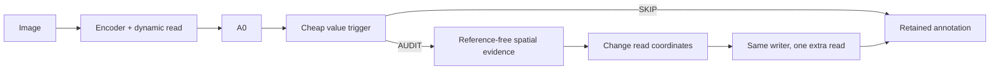
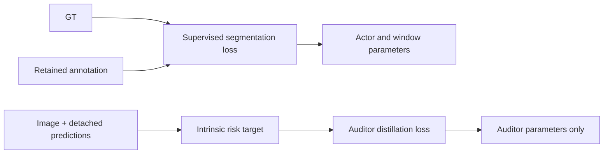
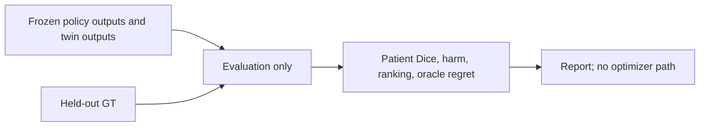

# Problem and estimand

Status: PROPOSED mathematical hypothesis; implementation and measurements are reported separately in 08–12.

Can a predictor of the *incremental value of an audit-conditioned read*, trained only on intrinsic image–annotation signals, allocate a fixed audit budget so that a supervised segmenter improves patient-level accuracy per optimizer update, example, and wall-clock second compared with matched random, entropy, periodic and always-audit policies?

This has three independently falsifiable links: intrinsic contrast tracks true improvement; guidance changes useful evidence acquisition; predicting when to intervene beats simple allocation. Success at one link cannot establish the others. A correct implementation is not evidence of any link.

The primary estimand is patient-level retained Dice improvement and time to a prespecified Dice threshold, under an explicit training and inference policy. Secondary estimands are natural-transition ranking and intervention utility per call. Slice-level decisions are permitted, but patients are the independent evaluation units. Full-volume counts precede patient aggregation. No confidence interval treats adjacent slices as independent.

Annotation training may use segmentation GT. Auditor and Trigger training may observe images and predictions from this supervised actor; they may not observe target masks, target-conditioned features, true correctness maps, GT-derived quality targets, or GT-selected transitions. This is **supervised segmentation with reference-free audit**, not mask-free segmentation. GT is used in actor loss and evaluation only. Oracle decisions never enter training.

## Identifiability limit

Let observable state be identical in two worlds, including image, predictions, history and all RF scores. Let the audit mask occupy pixel 1 and the skip mask pixel 2. If hidden truth is pixel 1, true Dice contrast is +1; if hidden truth is pixel 2, it is −1. Any function of the observable state alone gives the same answer in both worlds. General semantic correctness is therefore not identifiable without an assumption connecting image evidence to anatomy.

Useful relative audit requires weaker, still substantive assumptions: the chosen image features distinguish the relevant structures; natural errors and useful edits change the proxy in the correct direction; that relation transfers to the deployment population; and the intervention has headroom. Smoothness, equivariance, inter-slice continuity and motion-cycle consistency can all hold for a systematically biased mask. They constrain solutions; they do not identify truth.

Even perfect regression of RF value does not imply a good clinical trigger. State-quality correlation does not imply correlation of *differences*, and population correlation does not imply calibration on the subset selected by a trigger. If, as an assumption rather than a proven property, every deployment contrast satisfies |ΔQ−ΔDice|≤ε, then true net benefit differs from RF net benefit by at most ε. A positive score smaller than ε is insufficient. This bound cannot be established from unlabeled observations alone.

## What “faster learning” would mean

For policy π, compare validation curves Dπ(u), Dπ(n), Dπ(t) against identical actor initialization, sample order, physical/effective batch, optimizer and evaluation schedule. Record first scheduled threshold crossing, censor failures, and integrate the learning curve. Audit setup, exploratory twins, RF updates, trigger updates, validation and data wait all cost time and must be disclosed.

With the chosen gradient firewall, RF loss contributes exactly zero gradient to actor parameters under **both** always-audit and event-audit. Thus reduced direct actor–auditor gradient conflict cannot explain a gain in this baseline. Possible mechanisms remaining are different supervised training paths, allocation to informative states, and reduced compute. Compare supervised gradients of skip versus guided branches on the same state to investigate path-dependent gradient alignment; do not describe this as gradients from an RF reward.

A compact actor on 64×64 ACDC is a falsification instrument. It cannot establish improvement over a strong pretrained A0, full-resolution performance, clinical quality, CUDA efficiency or external-domain robustness.

## Four separate pipelines

