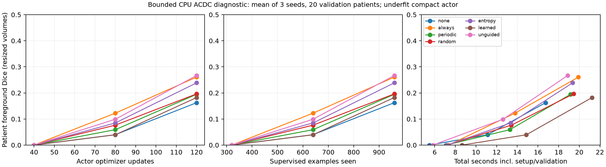

# Convergence and compute accounting

**MEASURED conclusion: faster convergence is not demonstrated.** Every method remains below all prespecified mean-patient Dice thresholds (0.5, 0.7, 0.8). Updates/examples/wall time to reach each threshold are null and right-censored, never assigned the final run duration. The highest mean retained Dice is only 0.2669. No epoch-based convergence claim is made.

The SVG is also available in `evidence/bounded_learning_curves.svg`. Three measured validation points per curve (40, 80, 120 actor updates) are joined for visibility; the lines do not establish the unobserved trajectory between evaluations. Curves average three seeds and full 20-patient metrics; no independent-slice confidence band is drawn. All arms use physical B=8, effective B=8 and one optimizer update per eight supervised examples. The common warmup is included in the axes, so the last point is 120 updates / 960 examples, not 80/640.

## Learning-curve and wall measurements

| Policy | Normalized Dice AUC, updates 40–120 | Total CPU wall seconds | Post-warmup data wait | Actor + probes | Slow optimizers | Scheduled validation |
|---|---:|---:|---:|---:|---:|---:|
| none | 0.06058 | 16.74 | 6.68 | 0.98 | 0.001 | 5.28 |
| always | 0.12637 | 19.91 | 6.73 | 1.83 | 0.137 | 5.93 |
| periodic | 0.07818 | 19.16 | 6.69 | 1.56 | 0.140 | 5.49 |
| random | 0.08730 | 19.45 | 6.71 | 1.68 | 0.141 | 5.64 |
| entropy | 0.10207 | 19.35 | 6.61 | 1.69 | 0.136 | 5.63 |
| learned | 0.06534 | 21.24 | 7.16 | 1.51 | 0.150 | 5.55 |
| unguided | 0.11630 | 18.88 | 7.64 | 1.51 | 0.001 | 5.93 |

AUC is the trapezoidal integral divided by the update span, **40–120 only**; there was no warmup learning-curve sampling. The example-based normalized AUC is identical because every update uses eight supervised examples. Per-run wall-time AUC is stored, but its integration intervals differ because setup and run duration differ. It is not a fixed-horizon wall-time dominance test. Best validation Dice is retained in every JSON; no checkpoint was chosen using test data.

Wall includes the actor setup, RF/value setup actually required by that policy, data loading, training and the same three scheduled validations. The final all-state twin evaluation is separately timed and excluded. The columns are not an additive decomposition of the whole run: setup, Python/control overhead and bookkeeping fill the remainder. Data reads dominate model compute for this tiny CPU actor, and process/file cache effects remain. Trials were sequential on one local machine; CPU clock/load was not controlled. These are measured diagnostic costs, not a GPU throughput or statistically established speedup.

Learned uses **21.24 seconds**, versus 16.74 no audit, 19.91 always audit and 18.88 unguided extra reading, averaged across seeds. It has fewer policy audit invocations than always, yet pays exploration, score evaluation, replay and value optimization costs. Sparse invocation does not imply cheaper training.

## Invocation versus optimization

Counts below are example-level calls over logical standalone setup + post-warmup training; they are not FLOPs. Shared warmup is charged separately to each hypothetical standalone policy. Diagnostic-only validation/probes of validity are excluded here and recorded in raw receipts. Every actor update count is 120.

| Policy | Audit invocations incl. setup/probes | Auditor optimization forwards | Dynamic reads | Intrinsic energy evaluations |
|---|---:|---:|---:|---:|
| none | 0.0 | 0.0 | 960.0 | 0.0 |
| always | 804.3 | 288.0 | 1892.3 | 616.7 |
| periodic | 484.3 | 288.0 | 1572.3 | 616.7 |
| random | 484.3 | 288.0 | 1572.3 | 616.7 |
| entropy | 484.3 | 288.0 | 1572.3 | 616.7 |
| learned | 425.3 | 288.0 | 1641.3 | 872.7 |
| unguided | 0.0 | 0.0 | 1600.0 | 0.0 |

No/unguided have zero RF and Trigger optimizer steps. Each audit policy has 16 warmup + 20 subsequent RF updates. Learned alone has 16 warmup + 20 subsequent Trigger updates. A replay RF forward is an **optimization observation**, not an audit intervention on the live actor. Exploration twins are interventions that must be charged even when the live policy skips. Setup value probes also require actor reads and Auditor calls. The extra 256-update frozen-head diagnostic is separate and is not included in these original-run costs.

The 0.5 cap applies to live policy decisions, not the total of policy + exploration + optimizer observations. Mean training audit invocations per supervised example including used setup are 0.838 always, 0.505 periodic/random/entropy, 0.443 learned and zero no/unguided. No claim of a 50% *total computation* budget follows from the cap. The cost of a score evaluation is also distinct from a learned spatial Auditor forward.

Hardware accounting: new runs used **zero CUDA**, so VRAM is null / NOT MEASURED. `peak_process_host_rss_raw` is the cumulative process high-water mark (macOS bytes), shared across policies; it cannot rank their individual peaks. Host RAM, data wait and model compute are distinct. Remote cgroup quota was inspected, but no worker-count or GPU batch autotuning occurred. User-reported B32 fitting an RTX4060Ti does not establish late-training peak, speed or a fair comparison with B8 here. 4090, checkpointing and B/accumulation recipes are outside the executed experiment.

## Why faster learning remains a hypothesis

The actor optimizes supervised segmentation of the retained path; it never directly maximizes RF score. Therefore direct cross-loss RF/actor gradient interference is already blocked in **both** always and selective audit. It cannot explain a benefit unique to selective invocation. Different paths can still change supervised gradients and optimization trajectories. Useful intervention density, path-gradient alignment at frozen theta, curriculum and reduced unhelpful rereads are testable possibilities, not observed causal explanations here.

A proper future comparison would fix a meaningful pretrained A0, optimizer/batch/example stream, measure the same threshold/compute horizon, count initial RF setup and all exploration, and compare both matched updates and matched wall time. Strong-A0 headroom is UNKNOWN. It is invalid to compare B8 and B32 by epoch, or to interpret the present weak-A0 gain over no-audit as a strong segmentation result.
