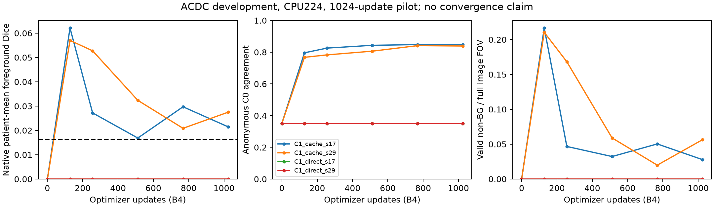

# Results — bounded real ACDC, 18 September 2026

**The implemented pipeline does not yet generate useful named anatomy.** C0 is the
pre-GT-selected PROVISIONAL control, not a successful segmenter. All five successful
GT evaluations verified frozen outputs first. No metric selected a checkpoint,
threshold, class mapping or architecture in this cycle.

## Actual execution and data

* Local CPU, four Torch threads, one interop thread, zero loader workers; CUDA/MPS
  unused. `vast-gpu` connection refused; exact failure is retained.
* 100 patients, 200 raw-shaped ED/ES frame volumes, 1902 slices: 1526 training and
  376 development slices, 80/20 disjoint patients. Existing split retained by hash.
* Full FOV, all slices, aspect-preserving 224 resize/pad; native shapes/affines
  restored on export. Native-to-working scale ranges 0.4375–1.0769; the 512-pixel
  FOV is downsampled substantially. Preservation of every thin MYO structure has
  **not** been established. No image-only anatomical ROI was invented for this run.
* Four sequential scratch runs: C1-cache/direct × seeds17/29; B4, Adam .001,
  1024 updates and 4096 exposures each. Eight-step pilot discarded. Final-step
  checkpoint fixed. Actual sample-index hashes match between objectives for each seed.
* References were unavailable to the method interface and blocked by its active
  Python file-open guard. An image-only mirror, raw/mirror hashes and source-read
  ledgers were retained. This is not a kernel-level trace or certification against
  arbitrary masks renamed as images. Historical cohort provenance remains qualified
  in SUPERVISION_LEDGER; this is not an untouched test cohort.

## Named anatomy and coverage

Native volume counts are aggregated across ED/ES within each patient, then averaged
over 20 patients. Primary Dice counts UNKNOWN255 as missed anatomy; unknown is never
converted to BG. No slice-based confidence interval or significance claim is made.

| Arm | Foreground Dice | RV | MYO | LV | Patients worse / better / tied vs C0 |
|---|---:|---:|---:|---:|---:|
| **C0 selected** | **0.01623** | .00218 | .01548 | .03104 | 0 / 0 / 20 (identity control) |
| C1-cache seed17 | .02146 | .00056 | .01911 | .04469 | 4 / 7 / 9 |
| C1-cache seed29 | .02751 | .00281 | .01840 | .06132 | 5 / 8 / 7 |
| C1-direct seed17 | 0 | 0 | 0 | 0 | 9 / 0 / 11 |
| C1-direct seed29 | 0 | 0 | 0 | 0 | 9 / 0 / 11 |

The zero harm of C0 versus itself is an identity convention, not audit evidence.
Harm here means any strictly negative patient-level delta (numerical tolerance 1e-12),
not a clinically calibrated threshold. Cache mean improvements are .00522/.01127,
with 20%/25% of patients harmed; neither low absolute Dice nor these paired deltas
support deployment. Patient rows are in `evidence/patient_deltas.csv`.

| Arm | Valid non-BG / image FOV | UNKNOWN / resized FOV | True RV/MYO/LV pixels covered by any known output | Conditional foreground Dice on known pixels only |
|---|---:|---:|---|---:|
| C0 | 3.994% | 37.19% | 19.54% / 48.73% / 18.61% | .02323 |
| Cache17 | 2.787% | 31.13% | 19.70% / 60.05% / 17.60% | .03739 |
| Cache29 | 5.644% | 27.32% | 31.29% / 68.62% / 27.96% | .03568 |
| Direct17/29 | 0 | 100% | 0 / 0 / 0 | Undefined, no known pixels |

“Covered” means an output other than UNKNOWN, not the correct output class. The first
two columns use resized unpadded FOV; GT class coverage uses native patient counts.
Conditional Dice is an explicitly biased subset metric, always shown with coverage.
These are fixed operating points, not a calibrated quality–coverage curve; the
resolver has no calibrated confidence threshold to sweep.

## Partition quality is a separate failure

Native per-volume anonymous ARI means are C0 .02282, cache17 .02112, cache29 .02781,
direct approximately zero. Offline oracle permutation-aligned four-class macro Dice
(including BG) is .20023/.19870/.21463/.24493/.24493, respectively. The all-one-cluster
direct output can score .24493 by matching dominant BG; that is **not** a superior
partition or a valid named result. No oracle mapping enters exported masks.

Low named scores cannot be attributed to naming alone: the anonymous partitions also
carry poor overlap under these diagnostics. There is no independent evidence that
this C0 teacher repairs anatomical errors. Increasing teacher agreement therefore
does not certify useful learning.

## Ontology audit and interventions

In **376 real C0 development slices**, R1=376, R3 enclosure=35, R4 remainder=13,
R5 intensity fallback=339, R7 absent=246, R8 contour=376, R9 unsupported=2.
**R2 merges=0.** Thus over-merging is not the demonstrated failure in this C0 run.
The separate existing-maskfree leaf profile also observed zero R2 merges across its
32 measured candidate traces; this small sample does not establish global absence.

Unresolved units: 341/376 (90.69%). Among unresolved traces, the note
`orientation_metadata_absent_left_right_unresolved` occurs339 times, enclosure tie2,
no foreground2; notes can co-occur. Raw valid class pixels at resized FOV are
BG9,231,108 / RV169,349 / MYO311,485 / LV145,974. “Valid” means resolver-admitted,
not independently calibrated correctness. Missing orientation alone does not prove
that supplying orientation would repair these partitions.

Actual resolver synthetic test, same image: a closed ring has enclosure2→1=1.0;
a four-neighbour radial gap removes that relation and all valid MYO/LV. Partition
agreement is .999240, ring Dice .995142, but unknown fraction rises0→.163845.
This fixture is new; it is **not** the earlier independent .98947-Dice chat probe.
Permutation of anonymous IDs preserves naming. Missing MYO abstains; all-empty
partition is all UNKNOWN. Displacing the ring12 pixels with the image fixed still
passes enclosure with full validity. Dilation, erosion and smoothing also pass.
These show that topology/validity are not calibrated image-conditioned correctness.

Real image-only stress test: in the **35 R3-eligible slices**, a deterministic
horizontal opening removes R3 in **29/35**. Median partition agreement .999032
(**99.90%**, not 99.97%), median named agreement .671511, minimum .271991.
Some surviving R3 cases switch which group receives MYO versus RV. This establishes
topological sensitivity for this selected subset; it is not a GT-guided edit,
unconditional failure rate, or proof that ring closure is the sole MRI bottleneck.
No smoothing or resolver threshold was changed after observing this result.

## Learning curves and convergence limits

The dashed black line is C0 Dice. Green/red direct curves overlap. All vertical
quantities have different meanings: higher teacher agreement does not imply better
named anatomy. Cache17/29 Dice at updates128 peaks descriptively at .06212/.05702
then fluctuates and ends at .02146/.02751, while anonymous agreement generally rises
toward .848/.839. We retain update1024, not those GT-observed peaks.

Normalized trapezoidal development Dice AUC over updates0–1024: cache17 .02719,
cache29 .03377, direct both0. This is posthoc descriptive analysis, not a selection
criterion or evidence of statistically faster convergence. No target Dice X was
preregistered, so a favorable time-to-X is not manufactured after the run. Raw
curves include optimizer updates, image exposures, training seconds and elapsed
seconds. Each arm saw only ~2.68 training-set equivalents; convergence remains
UNKNOWN. No 64×64/120-step claim was reused as evidence here.

Both objectives had finite losses and nonzero gradients in all recorded initial
parameter tensors. Minimum parameter-gradient norm: cache17 .00125, cache29 .00299,
direct17 5.76e-6, direct29 6.29e-6. The direct loss can optimize without discovering
meaningful partitions; nonzero gradients are software evidence, not signal utility.
All direct checkpoints after128 yielded a one-group anonymous prediction and all
UNKNOWN naming in the measured development exports. No anti-collapse patch was added.

## Measured cost

CPU4, no simultaneous benchmark; B1 warm latency uses the same32 evenly spaced
development slices after3 warmups. It includes clustering/network, ID alignment and
resolver, but excludes disk reads, normalization, native export and evaluation.

| Arm | Partition/forward p50 | Image→named p50 / p90 | Train-only seconds | Train + later validation/export | Host peak RSS |
|---|---:|---:|---:|---:|---:|
| C0 | 43.38ms | 59.58 / 75.92ms | N/A | N/A | 861MiB |
| Cache17 | 10.60ms | 24.83 / 30.00ms | 91.085 | 162.199s | 1431MiB |
| Cache29 | 10.41ms | 26.32 / 34.79ms | 90.841 | 160.469s | 1438MiB |
| Direct17 | see raw | 12.31 / 13.23ms | 103.815 | 146.147s | 1417MiB |
| Direct29 | see raw | 12.31 / 15.63ms | 102.302 | 143.951s | 1408MiB |

Preparation2.795s, C0 generation82.915s for1902 slices. C0 development naming9.116s
and native export1.034s yield a measured-stage sum95.861s. Neural runs additionally
have step0 export7.1–7.9s, excluded from the main loop timer. Including shared prep,
cache, initial export components and loop gives per-independent-arm measured sums
255.628/254.008/238.921/237.557s. In the actual suite cache/prep were paid once, not
four times. Direct loss did not need cached targets for gradients; it used C0 for
its locked diagnostics. These sums omit startup, diagnostic benchmarks, evaluation,
some bookkeeping and pilot, so are not mislabeled exact process wall time.

Cache trains at44.97/45.09 exposures per train-only second; direct39.45/40.04.
Cache inference is about2.40×/2.26× faster than C0 on this scoped warm metric, but
its semantic/coverage admission fails. All-UNKNOWN direct output is cheap abstention,
not an accuracy-preserving speedup. Expected large-scale/GPU gains are UNKNOWN.

### Existing maskfree cost, separately measured

Eight real224 slices, B1 CPU4, one warmup, component instrumentation and actual forward
hooks: producer118,865 parameters, each student118,644, total356,153. Producer makes
three loss forwards plus one feature forward; each student makes one forward.
Median seconds: data .0361; producer three-forward/backward .1795; extra feature
.0200; candidate bank .0993; audit .3363; students .0606 + .0605.

Audit is the largest measured leaf. This excludes optimizer stepping, worker/IPC,
full finalization, validation/export and launch overhead. The old pipeline's fitting
view differs from C0 full-image preprocessing. It is **not** a matched whole-pipeline
speed comparison. Parameter count alone would miss repeated producer reads, candidate
construction, fitting/scoring and two student updates. Finalization repeats bank/audit
and annotation/export work; its cost remains unmeasured here.

## Software results, failures and limits

12 scoped tests passed; final JUnit receipt retained. They cover actual ring-gap,
ID permutation, absent/empty anatomy, shape and finite/nonzero gradients for both
losses, no cross-sample state, blocked reference open, bit-identical two-step training
under missing/swapped references, raw-image preparation without mask reads, patient
overlap rejection, native geometry/unknown, deterministic unbalanced partitions,
and evaluation refusing a changed prediction before its first GT read. The separate
end-to-end C0 CLI fixture also passed native output/hash/no-training/no-evaluation
checks; it is synthetic integration evidence, separate from the real ACDC results.

Initial failures were retained and corrected: input suffix `.nii` support; overly
broad filename guard blocking Torch source; NIfTI affine precision test; optional
sklearn import absent in evaluator. The evaluator was replaced with the standard
contingency-table ARI formula, checked against analytic fixtures. The failed first
evaluation imported nothing from GT before that dependency error. One earlier cache
preparation timing overlapped a software test and was excluded; clean v3 is reported.
Current method sources remained unchanged through all main runs and freeze.

No GPU equivalence/peak-VRAM claim, converged training, memory advantage, auditor
advantage, final untouched test, M&Ms or clinical utility was tested. Named NIfTI/NPZ,
checkpoints and the image cache remain in `/tmp/astra_nogt_runs` and
`/tmp/astra_nogt_cache224_v3`; hashes/metrics are committed, private images and model
binaries are not. The `/tmp` artifacts require retention before machine cleanup.
