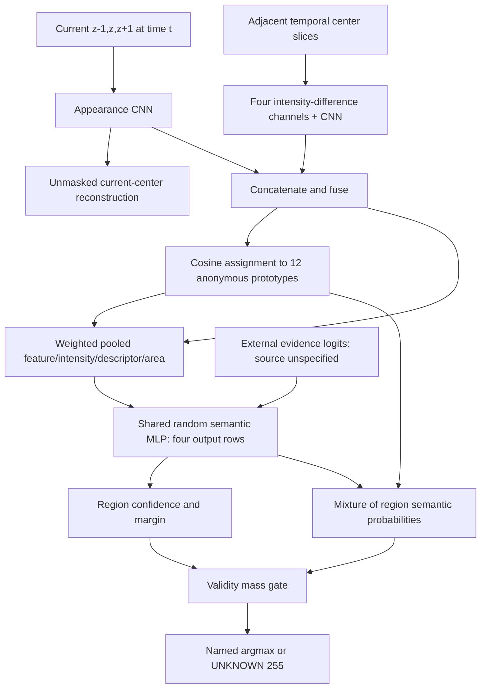

# Astra code audit

Audited starting point: `d4f503b7107eca4e8ac85f37a5dd01ec50479666`. Astra independently read the complete v3 module, canonical Dynamic Window generator/attention, AnnotationExpert initialization/forward, maskfree discovery/dataset/firewall/losses, and supervised ACDC/M&Ms loader paths. Worker A is supporting evidence, not the authority.

## Executed teacher graph

For input `B,3,H,W`, let `h=ceil(H/4), w=ceil(W/4)`.

| Step | Shape at defaults | What actually happens |
|---|---|---|
| Appearance | `B,48,h,w` | 24/48/96-channel double-convolution blocks, 1x1 projection; center-image reconstruction `B,1,H,W` |
| Motion | `B,16,h,w` | `[cur-prev,next-cur,abs(cur-prev),abs(next-cur)]` on center z only; convolution, not optical flow |
| Fusion | `B,64,h,w` | 1x1 convolution, GroupNorm, GELU |
| Prototypes | `B,12,h,w` | Normalized feature/prototype cosine, temperature .1, softmax over K |
| Pooled region | `B,12,67` | 64 means + image intensity + mean learned motion descriptor + area fraction |
| Semantic head | `B,12,4` | MLP 67→96→4; optional same-shaped additive evidence; class softmax |
| Dense probability | `B,4,H,W` | Convex sum over prototypes, then bilinear resize with `align_corners=False` |
| Valid/pseudo | `B,H,W` | Boolean acceptance; four-class argmax; rejected pixels become 255 |

`pool_regions` (`system_v3.py:86` at base) has no spatial coordinates, shape moments, connectedness, topology, physical motion magnitude, or cross-frame region identity. A prototype can cover multiple disconnected structures. Area normalization is numerically bounded but does not prevent collapse. `motion.mean(1)` averages signed learned channels, not speed.

Softmax simplexes and odd-size shapes pass. Soft probabilities carry gradients; argmax, comparisons and validity do not. No teacher loss/optimizer/seed generator/round scheduler is implemented. Reconstruction sees its own unmasked center target: an autoencoding shortcut is possible, although the bottleneck prevents a literal guaranteed identity copy. Reconstruction loss reaches appearance only; it gives no semantic CE or gradient to motion/fusion/prototypes/semantic head. A deliberately chosen differentiable semantic diagnostic reaches those modules, which proves connectivity only.

## Two reproduced defects and isolated corrections

1. **UNKNOWN loss crash.** Base `pseudo_supervision_loss:188` computes CE over every target before indexing `valid`; target 255 raises `IndexError` even where validity is false. The original test used target zero and did not exercise UNKNOWN. Candidate selects `valid & target != 255` first, then CE; empty acceptance returns differentiable zero.
2. **False pixel confidence.** Four equally weighted regions with four different certain names all pass the region gate. Base returns every pixel valid despite dense maximum .25 and margin zero. Candidate additionally applies probability/margin thresholds to the final interpolated pixel mixture. Region-validity mass remains required.

These are software corrections under identity `astra-v3-software-audit-fix-v1`, not a new successful teacher. Base source SHA256 `4c07ee074daa060f0a33095162c5a75096e745f97082dcc34d8fa38cfda83226`; candidate `1077187c880f463d38f171eb8d2690cf5f0aa0ca022d797e25d1e34a36bafb06`. Canonical Dynamic Window and AnnotationExpert are unchanged.

## Intervention interpretation

At seed 17, random initialization and synthetic 64² images, zero/shuffled motion, temporal reversal and shuffled z neighbors change soft output but all remain UNKNOWN. Zero evidence is exactly invariant. Random evidence produces acceptance .9785 at base and .08936 after the pixel-gate fix; arbitrary strong LV evidence gives 100% LV. The interface can inject confidence without anatomical truth.

Reordering prototype rows preserves the dense output to 1.19e-7 because the semantic MLP is shared and the mixture is permutation invariant. Reordering semantic output rows permutes named anatomy exactly without altering reconstruction. Worker A's prototype-index argument must not be confused with the separate semantic-name ambiguity.

Evidence: [baseline interventions](evidence/root_interventions_baseline.json), [candidate interventions](evidence/root_interventions_candidate.json), [tests](08_TEST_RESULTS.md). Software validity does not establish segmentation quality.
