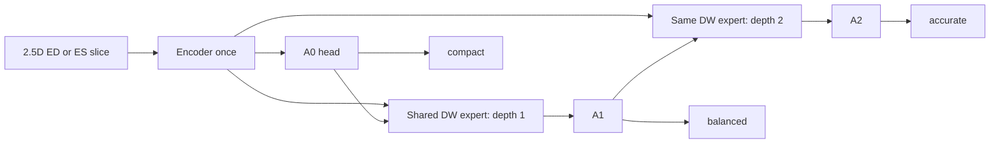

# Dynamic Window review

**Placement is coherent; benefit is unproved.** Dynamic Window belongs in the final annotator as optional refinement. Its spatially varying supports are not a named-anatomy source.

## Root-verified execution

`AnnotationExpert.forward` at base lines 351–470 constructs state from shared image features, resized current logits, normalized entropy and zero audit channels. `feature_only` also passes no audit condition to the window generator. Root changed audit tensors and obtained identical output/coordinates, then changed annotation logits and obtained changed coordinates.

| Profile | Encoder calls per slice batch | Outer refinement turns | Internal DW calls | Result |
|---|---:|---:|---:|---|
| compact | 1 | 0 | 0 | Exact same tensor as A0 |
| balanced | 1 | 1 | 1 | A1 |
| accurate | 1 | 2 | 3 | A2; internal depths 1 then 2 |

The image encoder is not rerun. A whole volume still requires slice/batch processing. The residual update is `A_next=A_previous+sigmoid(gate)*delta`. No graph detach exists. With A0 direct loss weight zero, final loss still reaches A0, its head, encoder and window generator. This is true recurrence.

`DynamicWindowGenerator` predicts bounded center/radius/angle/residual coordinates around a canonical K-point ring. `grid_sample` uses normalized coordinates and `align_corners=True` consistently with its base grid. Boundary clamping can saturate coordinate gradients. Current K=8 stays fixed per spatial query. Spatial support changes; token count/FLOPs do not change within a profile. Profile selection is external and deterministic on the tested CPU setup. GPU determinism was not established.

Metadata contains the last internal DW result per outer turn. Therefore two metadata entries in accurate do not mean only two DW invocations. Profilers/hooks are needed for full work accounting.

## A0 headroom: risk established, clinical degradation not established

The scaffold loss supervises final logits and A0 with default weight .25; A1 has no direct loss under accurate. Later-stage gradients may trade away early-exit quality. Root independently verified this gradient path.

Worker C reported synthetic A0 accuracy 60.64% versus 70.52% and called it a causal proof. Inspection of `C_evidence/probe_dynamic_window.py:262` finds a confound: the detached arm also changes A0 loss weight from .25 to 1.0. It uses random noise with the same fixed circular target and evaluates a training batch. It establishes neither cardiac degradation nor the isolated effect of detaching. Claims of guaranteed A0 optimality or “true innovation” from stop-gradient are rejected.

**Locked strategy if the teacher gate eventually passes:** train A0 first; freeze both encoder and A0 head; train the refiner with explicit equal A1/A2 pseudo CE. This preserves the A0 function by construction for the current GroupNorm encoder. It does not guarantee that A0 is optimal or that refinement helps. Compare joint training only as a controlled ablation with identical loss weights, data order, seeds and checkpoint policy.

## Mandatory ordinary-CNN control

Worker C's CNN has 121,668 parameters versus 80,462 total student parameters, and no verified matching of MACs or measured budget. Its “matched” and 2.16x causal-penalty claims are not accepted. F's timing also tracked autograd and is superseded for deployment by root inference-mode measurements.

Use the same frozen encoder/A0, conditioning tensor, update heads, outer turns and stage depth. Replace DW with an ordinary two-convolution residual block. Calibrate its hidden width using image-only latency measurements to within 5% of the chosen DW budget; retain a separate MAC-matched comparison if latency and MAC matching disagree. Freeze that calibration before any accuracy evaluation. Count all encoder, controller and refinement cost. Train both refiners from the same pseudo-label freeze and A0 checkpoint with the same optimizer/steps/seeds. A separately trained compact model is also required.

Retain DW only if it improves the paired patient accuracy–latency frontier against these controls without manufacturing a weak A0. Otherwise remove it. No such matched-compute semantic experiment has run because the teacher gate failed.

The existence of input-dependent sampling is prior art, e.g. [deformable attention](https://arxiv.org/abs/2201.00520). Reuse in this scaffold is not new scientific evidence.
