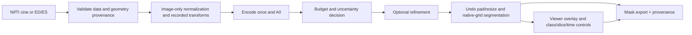

# Resource adaptation and application contract

**The profiles provide real selectable computation, but no adaptive selector or adaptive accuracy advantage exists yet.** Spatially adaptive attention and choosing a variable amount of work are distinct mechanisms.

## Root measurements

Same random-weight student, width 32/K8, state hash in [benchmark receipt](evidence/root_benchmark.json). Batch1, FP32, 224², `eval()` + `torch.inference_mode()`, 10 warmups, 40 CPU repeats, 30 synchronized MPS repeats. Pure forward excludes input allocation and host/device transfers. Actual host is macOS26.2 ARM64, 12 physical cores, 24 GiB RAM; Torch uses 4 intra-op threads and 1 inter-op thread. No CPU affinity or 8GB memory cap is enforced. This is a local diagnostic, not certification of the requested low-resource hardware.

| Profile | CPU p50 ms | p90 ms | p95 ms | MPS p50 ms | Conv-only GMAC | 10-slice image-to-grid-mask p50 ms |
|---|---:|---:|---:|---:|---:|---:|
| compact | 9.728 | 9.978 | 10.010 | 0.957 | 0.795189 | 133.11 |
| balanced | 15.279 | 16.382 | 16.899 | 2.157 | 0.896645 | 190.86 |
| accurate | 24.989 | 26.131 | 26.345 | 3.986 | 1.080791 | 311.46 |

Total student parameters: 80,462; encoder47,328, A0 head132, refiner33,002. Teacher parameters181,565. Compact executes 47,460 parameters but the shared object still holds the refiner. That unused FP32 parameter storage is about129 KiB, so Worker F's categorical “compact is not lightweight in memory” is disproportionate to the measured process footprint.

Conv-only MACs exclude attention products, normalization, interpolation, trigonometry, softmax and grid sampling. Twice these MACs is a convolution-only FLOP convention, not total model FLOPs. Root hook counts confirm encoder1 for every profile, outer turns0/1/2 and DW0/1/3. Incremental CPU p50 relative to compact is 5.55ms balanced and 15.26ms accurate; these include every refinement operation and are not isolated `grid_sample` cost.

Fresh-process wall times (Python/import/random construction/one inference) are compact839ms, balanced613ms, accurate622ms; first-forward times21.85/21.18/32.32ms. One sample each, OS caches not flushed, no trained checkpoint load. Fresh-process peak RSS316.6/323.8/332.4 MiB. Parent-process cumulative peak RSS389.1/391.8/464.6 MiB must not be interpreted as per-profile incremental peak. MPS peak memory was not measured; live allocations are not peak. CUDA is unavailable.

The real image-only stored-grid diagnostic loads and normalizes `patient093_frame01` (180x224x10), aspect-pads to224, predicts every slice, restores logits before argmax and assembles the array. Five warm volume repeats; p90 is140.62/202.74/318.62ms. It includes image read, normalization, resize/pad, model, inverse resize and array assembly; excludes serialization, trusted physical geometry, UI, IPC, export and checkpoint load. Random masks carry no accuracy claim. Full clinical raw-to-native-mask runtime remains NOT RUN.

## Reconciliation with F

F used `.eval()` without disabling autograd for CPU/MPS and synthetic postprocessing timings. Its “cold” forward follows FLOP profiling in an already-warmed process. Its RSS before/after is not peak RSS, and four threads are not core pinning. THOP incompletely counts the non-module attention/sampling path. Root measurements supersede these for deployment interpretation. No cache-miss or bandwidth profiler supports F's causal assertion that `grid_sample` explains the entire latency gap. Moving argmax before resizing changes predictions and cannot be introduced as an equivalent optimization.

## Required fixed-versus-adaptive experiment

Compare fixed compact, fixed balanced, fixed accurate, deterministic uncertainty-based continuation, and budget-matched random routing. Freeze weights and thresholds before evaluation. Include measured controller cost and all encoder/refiner passes. Match average end-to-end volume latency, report tail latency and per-patient harm; compare the full accuracy–cost frontier, not a single flattering pair. Runtime GT is forbidden.

A future router may use hardware budget and image-derived uncertainty, but entropy is not proven to predict correction benefit. It needs an `encode_once`/continuation contract: computing A0 to choose a profile and then calling current `forward()` again would repeat the encoder. No controller is implemented during this failed teacher gate.

## Hardware protocol to lock next

- CPU target: four pinned physical CPU cores, 8GiB host/cgroup limit, no accelerator, FP32/batch1, runtime/library/OS hashes, at least100 warmed volume repeats after separately measured cold startup.
- GPU target: NVIDIA T4 16GB, fixed power/runtime settings, CPU preprocessing tracked separately, synchronization at timing boundaries, transfers included in end-to-end timings, peak allocated/reserved memory. This target is NOT RUN; local MPS is a separate exploratory device.
- Report per-slice and per-volume p50/p90/p95, cold start, peak RSS, encoder/DW counts, model mode, preprocessing and UI/export overhead. Offline teacher training/generation time and storage get a separate ledger; do not hide them in deployment savings.

## End-to-end application contract (specification only)

Output includes BG/RV/MYO/LV mask, optional validity/uncertainty, native array geometry status, profile per slice, latency breakdown, peak memory status, input/model/config/source hashes, class schema and run ID. Invalid physical geometry is explicit, never guessed. Mask export uses discrete labels, correct axis order and verified affine; uncertainty uses its own floating-point volume. UI later needs overlay, class toggles, slice/time navigation, profile control, runtime statistics, export and run history. No frontend was built. UI functionality is a system deliverable, not the main novelty.
