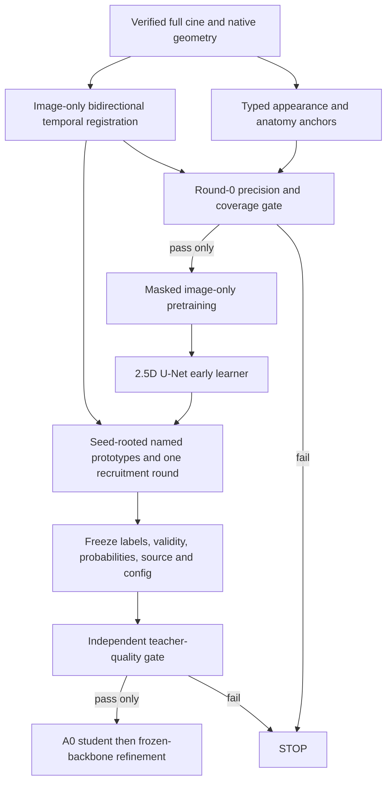

# Experiment plan and one baseline lock

**Current decision: TEACHER_NOT_READY. Stop progression and long student training.** This section records a completed bounded falsification experiment and ONE next baseline specification, not authorization to bypass the failed gate.

## Completed Round-0 experiment

Identity `astra-v3-r0-geometric-seeds-20260920-v1` aborted before freeze/evaluation because physical units were unknown. It is preserved with its error. Before any GT access, a separate identity `astra-v3-r0-dimensionless-seeds-20260920-v2` fixed dimensionless priors in the stored image grid. This is an image-only geometric seed diagnostic, **not a trained CinePseudoTeacher result and not a revival of C0**. It used neither C0/C1 labels nor their checkpoints.

Four train and four development patients were chosen independently by the lowest `sha256('astra-v3-r0-'+patient_id)` within the frozen80/20 split. Both phase volumes and every native stored-grid slice were included (16 volumes). No GT existence check was used for this selection; the parent local acquisition still has disclosed historical paired-file selection.

The seed generator used a compact bright component as a provisional LV anchor, adjacent bright pool as RV, darker annulus as MYO, and border-connected dark image background as BG. Fixed topology, boundary, neighboring-z and gamma-stability filters defined seven arms. `all_available` was the primary candidate before evaluation; no best-arm selection followed GT results. Native orientation, motion and full-cycle temporal consistency were **NOT RUN**, because required data/geometry were unavailable.

Pseudo arrays encode validity as `label != 255`; NPZs, config, source script, split and image hashes were frozen before H opened any GT. Manifest SHA256: `c0be95e4f3e6bf63277e576f80f0d89aacc949b48630bf211883e786d141196e`. H verified before/after; root inspected and reran the evaluator and independently recalculated Dice from complete confusion counts. [Freeze](evidence/round0_v2_FROZEN.json), [config](evidence/round0_v2_config.json), [metrics](workers/H_evidence/evaluation_results.json), [root verification](evidence/root_evaluator_verification.json).

| Split | Frozen arm | FG Dice | Accepted FOV | UNKNOWN | RV precision / GT coverage | MYO precision / GT coverage | LV precision / GT coverage | RV/LV swap | Seed gate |
|---|---|---:|---:|---:|---:|---:|---:|---:|---|
| train | appearance_anchor | 0.368078 | 20.63% | 79.37% | 0.7186 / 32.02% | 0.4596 / 13.14% | 0.7698 / 45.41% | 7.019% | FAIL |
| train | plus_topology | 0.368078 | 20.63% | 79.37% | 0.7186 / 32.02% | 0.4596 / 13.14% | 0.7698 / 45.41% | 7.019% | FAIL |
| train | plus_boundary | 0.365621 | 20.62% | 79.38% | 0.7186 / 32.00% | 0.4588 / 12.97% | 0.7704 / 45.30% | 7.029% | FAIL |
| train | plus_cross_slice | 0.169247 | 19.53% | 80.47% | 0.8941 / 14.33% | 0.6590 / 4.57% | 0.9846 / 27.58% | 0.516% | FAIL |
| train | plus_augmentation | 0.237158 | 17.05% | 82.95% | 0.7222 / 14.03% | 0.5737 / 6.14% | 0.9574 / 34.77% | 0.740% | FAIL |
| train | all_available | 0.142947 | 16.70% | 83.30% | 0.8826 / 9.98% | 0.7304 / 3.19% | 0.9918 / 25.27% | 0.556% | FAIL |
| train | unknown_control | 0.000000 | 0.00% | 100.00% | null / 0.00% | null / 0.00% | null / 0.00% | null | FAIL |
| dev | appearance_anchor | 0.352396 | 15.19% | 84.81% | 0.6359 / 21.03% | 0.6656 / 20.48% | 0.9410 / 56.79% | 0.245% | FAIL |
| dev | plus_topology | 0.352396 | 15.19% | 84.81% | 0.6359 / 21.03% | 0.6656 / 20.48% | 0.9410 / 56.79% | 0.245% | FAIL |
| dev | plus_boundary | 0.353184 | 15.19% | 84.81% | 0.6371 / 21.03% | 0.6727 / 20.48% | 0.9445 / 56.79% | 0.245% | FAIL |
| dev | plus_cross_slice | 0.164322 | 14.47% | 85.53% | 1.0000 / 1.20% | 0.8478 / 10.06% | 0.9996 / 41.22% | 0.000% | FAIL |
| dev | plus_augmentation | 0.247789 | 10.73% | 89.27% | 0.7581 / 7.91% | 0.7380 / 13.11% | 0.9654 / 43.82% | 0.000% | FAIL |
| dev | all_available | 0.139116 | 10.40% | 89.60% | 1.0000 / 1.09% | 0.8726 / 6.91% | 1.0000 / 32.97% | 0.000% | FAIL |
| dev | unknown_control | 0.000000 | 0.00% | 100.00% | null / 0.00% | null / 0.00% | null / 0.00% | null | FAIL |

Precision/coverage in the table pool voxels within each split; the Dice column is patient/phase/class macro, not pooled voxel Dice. Coverage here is correctly accepted voxels / all GT voxels of that class. Swap numerator is GT-RV→LV plus GT-LV→RV; denominator is all accepted predictions on GT RV/LV, including incorrect MYO/BG. A zero denominator is null. Sparse seed Dice counts UNKNOWN as missed anatomy. Low seed Dice by itself need not disqualify high-precision seeds; **these seeds fail the preregistered precision/coverage gate as well**.

For the fixed primary candidate on dev, per-class macro Dice is RV .012736, MYO .127550, LV .277061. Overall accepted precision is dominated by BG. Foreground precision .97443 still hides MYO precision .87261 and RV coverage1.09%. Four of eight patients have no accepted foreground on the second phase. Relative to appearance_anchor, all_available reduces patient Dice in every evaluated patient. Correct accepted foreground falls from37,050 to15,394 voxels on dev. Topology changes no outputs here; boundary slightly increases dev Dice (.352396→.353184), so H's “every added cue hurts” sentence is rejected.

The fixed seed gate required each class precision≥.95, class coverage≥.05 and ≥.75 of patients with all three predicted classes. All seven arms fail on both splits. The tiny cohort supports rejecting this frozen precursor, not claiming a universal upper bound or a confidence interval around future .91 performance. Calibration is NOT RUN because hard geometric decisions expose no calibrated probabilities.

## Exactly one next baseline: B1 anchored cine teacher → A0-first student

Status **SPECIFIED, NOT IMPLEMENTED/TRAINED**. Implement and test its data/seed gate first. Do not train from the failed R0 outputs. Identity `astra-v3-B1-cine-anchored-ssl-v1`; all proposed constants below are engineering choices requiring a fresh pre-evaluation freeze, not values optimized on the just-opened development GT.

### Inputs and modules

1. `ImageOnlyCineDataset`: true `[X,Y,Z,T]` acquisitions, verified units/affines, patient/time/slice identifiers and inverse-grid transforms from report 06. Full-FOV1st–99th percentile normalization; aspect-preserving resize/pad224; z−1/z/z+1 at current time. Neighbor time frames must actually exist. Acquisition/motion operates offline; the student uses only a phase's z triplet.
2. `PhysicalAnchorSeeds`: the v1 physical-prior recipe (bright quantile70%, floor.45; LV equivalent radius6–35mm, eccentricity≤.85, solidity≥.75, central distance≤.35FOV, contrast≥.08, unique-winner ratio1.2; erosion1.5mm; MYO annulus1.5–5mm; RV radius4–35mm, separation6–65mm, patient-right displacement≥2mm). All are fallible typed priors. Missing trusted geometry means stop this identity, not substitute a guessed affine.
3. `CineTransport`: classical bidirectional TV-L1 registration on adjacent frames, image-only, no learned segmentation model; attachment15, tightness.3, num_warp5, num_iter10, tol1e-4, prefilter=False, float32. These settings use the [documented TV-L1 interface](https://scikit-image.org/docs/stable/api/skimage.registration.html#skimage.registration.optical_flow_tvl1). Reject a transported point when forward/backward error exceeds1 network pixel or normalized image residual exceeds.10. Full-cycle closure is tested only for verified complete cycles; incomplete cycles do not wrap. Cross-z agreement is a separate reliability cue, not a rigid same-pixel anatomy assumption.
4. `TeacherUNet25D`: encoder blocks of two 3x3 convolutions (padding1, bias=False), GroupNorm with 8 groups and GELU at widths 24/48/96/192; the first convolution in encoder blocks 2–4 uses stride 2, all others stride 1. Decoder widths 96/48/24 use bilinear upsampling (align_corners=False) to the skip grid, skip concatenation, then the same two-convolution block. A four-logit 1x1 output is at 224; pretraining substitutes a one-channel 1x1 reconstruction head. It replaces the anonymous-prototype-to-random-name MLP as the pixel learner. Four **named** feature prototypes are computed only from accepted seed pixels; an unseeded class stays unavailable. No learned runtime Auditor.
5. `AdaptiveAnnotationStudent(width=32, window_k=8)` as audited and corrected. Teacher is offline; deployment never loads its transport or seed engine.

### Training and pseudo-label process

- **Round0:** no segmentation learning. Validate each cue individually and fixed combinations, with the same metrics as this audit. Use a new frozen identity and declared development cohort. Gate failure stops before any teacher/student optimization.
- **Representation stage, only after a useful seed gate:** same teacher architecture, masked reconstruction pretraining on training images only; masks cover75% of16x16 blocks and are shared across all z channels. Reconstruct only the hidden center-channel pixels with L1. Fixed10 epochs, AdamW lr1e-3, weight_decay1e-4, batch8, accumulation1, FP32, seed17, final checkpoint. No external weights or manually segmented crop.
- **Round1 early learner:** initialize from that image-only checkpoint; train5 epochs with AdamW lr3e-4, weight_decay1e-4, batch8. Class-balanced partial CE on accepted frozen seeds plus .1 augmentation-consistency loss on the same supported pixels and .1 flow-warped temporal consistency on reliable correspondences. No entropy minimization on unanchored pixels. Average CE within each present accepted class, then across classes; omit an absent class rather than inventing labels. Consistency is mean squared error between four-class softmax vectors, averaged over valid pixels and directions; use gamma0.9 and1.1 views, and bilinear flow-warped stop-gradient targets. Empty supports contribute differentiable zero. Named prototypes use L2-normalized final-decoder24D features, normalized class means and cosine similarity at temperature0.1. No optional Dice, entropy or topology loss is added to this baseline. Stop gradients through pseudo targets/transport. Freeze the final-epoch prediction/probability/validity artifacts before evaluation.
- **Round2:** one recruitment, at most5 further epochs under the same objective. A new pixel requires named-prototype agreement, teacher top probability≥.95, margin≥.50, both gamma.9/1.1 decisions stable, reliable bidirectional temporal correspondence and no conflicting typed cue. Features/prototypes come only from previously accepted, provenance-tracked pixels; prototype EMA=.9. Freeze again. **No Round3 in this baseline.** Do not choose a GT-best epoch or best round.
- **Progression gate:** fixed preregistered development evaluation must improve named Dice and balanced coverage without increasing semantic swaps or causing more than.02 Dice harm on >10% of patients. These stop/go evaluations are research feedback; they are not a claim that the entire study is GT-blind. Thresholds cannot be retuned within an evaluated identity. If a stage fails, stop rather than continue self-training or select whichever GT-scored round looks best.
- **Teacher admission:** engineering gate macro foreground Dice≥.88 (investigate .90), each class Dice≥.85, correctly accepted GT-class coverage≥.80, semantic swap≤1%, with patient-level distribution and calibration reported. This is a conservative proposed threshold, not a theorem about attainable student accuracy. Final confirmatory data remain sequestered.

### Explicit scratch comparison

The chosen B1 uses **image-only SSL initialization**. Required control B1-S0 uses the identical U-Net, anchors, losses, pseudo freezes, post-seed optimization and evaluation, but random initialization and no representation pretraining. Report the extra SSL images, compute and storage. Thus the no-manual-mask claim is shared, while scratch versus SSL is explicit. An external CineMA SSL checkpoint is not silently substituted; its crop/selection/weight lineage is a separate future provenance investigation. Supervised CineMA/MedSAM checkpoints are excluded from both settings.

### Student, Dynamic Window and profiles after TEACHER_READY only

Train encoder+A0 for20 fixed epochs from the admitted frozen teacher labels; AdamW lr1e-3, weight_decay1e-4, batch8, FP32, image224, seed17. Class-balanced partial CE; UNKNOWN never trains as a fifth class. Freeze encoder+A0; train refiner10 fixed epochs, lr3e-4, equal CE on A1 and A2. Final checkpoints only. Repeat seeds29/43 after bounded feasibility, preserving all scientific settings. No teacher labels are updated during student training.

Compare A0-only, ordinary CNN refinement and DW with the same A0/pseudo checkpoint family. CNN replaces the DW attention operator with `Conv3x3(32,h)→GN→GELU→Conv3x3(h,32)` while retaining state/heads/recurrence. Choose h deterministically from multiples of8, 8..128, by closest latency within5% of the DW budget on image-only calibration; freeze before GT, otherwise declare matching failed. Also report a separate conv-MAC-matched control and a separately trained compact checkpoint. This is a specified matching algorithm, not an assertion that the current C worker CNN is matched.

Profiles remain compact=A0, balanced=one outer turn, accurate=two outer turns (three internal DW calls). A later image-only router uses volume-level mean normalized entropy on predicted foreground/boundary, a hardware budget and frozen training-image quantiles q50/q90 to propose these three profiles. No-foreground cases use the full-FOV90th percentile entropy. It must continue cached encoder features instead of calling the whole model twice. Compare fixed and random routing at matched measured budget; remove DW/router if they do not improve the matched frontier. Current adaptive superiority is NOT RUN.

## Evaluation protocol and final stopping criteria

For each patient i, phase p in ED/ES, class c in RV/MYO/LV, compute native stored-volume `D_ipc=2TP/(2TP+FP+FN)` without smoothing; UNKNOWN contributes FN. Primary `D=mean_i mean_p mean_c D_ipc`. Exclude BG. Preserve equal patient and phase weights; do not pool volumes/slices first. Both-empty classes are null with an explicit count and a prespecified class-conditional secondary aggregate; a primary three-class .91 claim requires the complete eligible class set rather than silent denominator changes. No per-case or cohort GT permutation is allowed for the named primary result.

Freeze class map, contour convention, patient split, masks/validity/probabilities, thresholds, data/input hashes, source/dependency hashes, checkpoint and hardware mode before evaluation. Report per-class/per-phase Dice, patient bootstrap CIs (patient is resampling unit), accepted precision and coverage, foreground and FOV UNKNOWN fractions, swap counts/denominators, calibration on all predictions and accepted subset, and per-patient harm. Synthetic/software passes stay separate.

ACDC≥.91 must be tested independently on a sequestered final patient cohort after development decisions. Current20 development patients have historical exposure and do not establish that claim. On M&Ms first run frozen ACDC→M&Ms transfer with no adaptation; separately train the same native recipe. Joint training is a separate setting. No M&Ms data means NOT RUN, not assumed transfer success.

Five high-information experiments, in dependency order: (E1) physical/cine data and cue precision–coverage gate; (E2) scratch versus SSL early learning on identical admitted seeds; (E3) one prototype/transport recruitment versus frozen-seed and random-recruitment controls; (E4) A0/CNN/DW matched frontier and A0-preservation ablation; (E5) frozen cross-domain transfer plus budget-matched routing. E2–E5 cannot bypass an earlier failed gate.

Stop for missing semantic evidence, failed seed/teacher gate, non-improving independent round quality, semantic swaps, provenance breach or unsupported geometry. Stop claiming DW novelty if the ordinary CNN matches it; stop claiming adaptive benefit if fixed/random budget controls match it. The current experiment already triggers STOP at E1.
