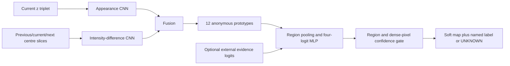
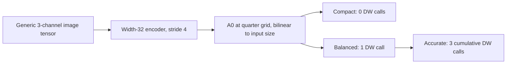
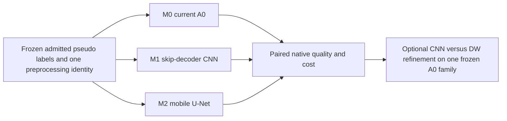
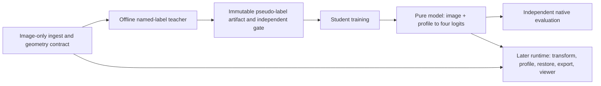

# Model-first research and system boundary — 2026-09-23

**Status:** research addendum at `b0288048ab12f01f4cb942b660d879a0f4f4ee75`. No trained v3 student, real-data v3 teacher, ACDC accuracy, M&Ms transfer, or target-hardware result is established here. This addendum does not change the locked Round-0 results or the B1 experiment identity.

## Decision

Keep the **deployable annotator** as the model-design focus. Its present width-32 A0 is an exceptionally small, measurable starting point, but there is no evidence yet that its output is anatomically useful. Develop the model interface and measure its cost now; defer a quality winner until a separately frozen, named pseudo-label source passes the teacher gate. Keep the later application/system boundary explicit without building its UI or runtime yet.

The scientific dependency remains: the frozen Round-0 `all_available` seed diagnostic achieved development macro foreground Dice **0.139116**; RV precision **1.00** covered only **1.09%** of true RV, and every arm failed the preregistered per-class seed gate. These are eight selected patients in a geometric-seed experiment, **not** a trained teacher's performance or a universal ceiling ([09_EXPERIMENT_PLAN.md](09_EXPERIMENT_PLAN.md), lines 7–36). B1 is specified and untrained (lines 38–98).

## What runs, and what does not

| Stage | Current executable state | Missing decision/evidence |
|---|---|---|
| Raw data | Existing supervised Self-Audit and CUTS/DFC benchmark paths have ACDC ED/ES adapters. | The v3 namespace has no image-only full-cine loader. Audited local ACDC has 200 ED/ES 3D images and no observed 4D cine; physical units/orientation are untrusted ([06_DATA_AND_FULL_CINE.md](06_DATA_AND_FULL_CINE.md), lines 3–7). |
| Offline teacher | `CinePseudoTeacher.forward` computes appearance, intensity differences, anonymous regions, semantic probabilities and abstention (`src/self_audit_pseudolabel/system_v3.py:41–139`). | No validated named-anchor producer, teacher objective, training schedule or admitted pseudo-label freeze. `evidence_logits` is an injection interface, not a semantic source. |
| Student | `AdaptiveAnnotationStudent.forward` returns A0 and optional refinement profiles; `pseudo_supervision_loss` filters UNKNOWN before CE (`system_v3.py:163–207`). | No v3 trainer, checkpoint lineage, frozen-label reader, inference CLI or trained quality. Literal caller scan of `src/`, `scripts/`, `configs/`, `tests/` finds these classes only in the package and synthetic tests. The loss does not validate accepted labels outside 0–3 or enforce minimum per-class support; a future artifact/trainer gate must do both. |
| Evaluation | Round-0 frozen-label evaluator and static benchmark infrastructure exist outside the v3 runtime. | No end-to-end v3 student evaluation or external transfer. The 20 ACDC development patients have historical exposure and are not an untouched test set ([12_SOURCE_OF_TRUTH.md](12_SOURCE_OF_TRUTH.md), lines 27–50). |
| Application | A future input-to-export contract is documented ([07_RESOURCE_ADAPTATION.md](07_RESOURCE_ADAPTATION.md), lines 39–54). | No v3 adapter, export service, profile controller, viewer or deployment validation. |

The two existing executable families must remain distinct: `src/self_audit/` is the locked **mask-supervised** canonical system ([docs.md](../../docs.md), lines 7–25); `src/self_audit_pseudolabel/` is the separate **mask-free research scaffold**. Running the former cannot validate the latter.

### Diagram 1 — implemented teacher forward

The name rows of the MLP can be permuted without changing the current reconstruction path or any **planned** class-symmetric objective; no teacher training objective exists in this scaffold. Current reconstruction observes its own unmasked target and does not supervise the semantic head. Thus this graph can execute but does not ground RV/MYO/LV ([02_CODE_AUDIT.md](02_CODE_AUDIT.md), lines 27–55; [03_SUPERVISION_AND_IDENTIFIABILITY.md](03_SUPERVISION_AND_IDENTIFIABILITY.md), lines 3–11).

The teacher's `prev/cur/nxt` are **different cine times**, whereas the canonical `VolumeSliceDataset` makes the three channels **neighboring z slices** (`system_v3.py:56–71`; `src/self_audit/data/common.py:231–244`). Passing the canonical loader's three channels as temporal frames would turn through-plane anatomical differences into false motion. A future dataset contract must type both the temporal dimension and the spatial triplet explicitly.

### Diagram 2 — implemented deployment student

The code accepts `[B,3,H,W]` and enforces neither ED/ES provenance nor a 224 size; a 224² input happens to yield 56² features. The encoder has no skip decoder. Refinement resizes A0 back to the same low-resolution feature grid, predicts low-resolution delta/gate maps and bilinearly enlarges them (`system_v3.py:155–191`; `src/self_audit/models/annotation_expert.py:368–390,448–452`). Thin-MYO/basal-apical boundary loss is a **mechanistic hypothesis**, not an observed clinical error. It needs native-grid contour and patient-stratified measurements.

At defaults the student has **80,462** parameters (encoder 47,328, A0 head 132, refiner 33,002). On the prior host, random-weight 224² FP32 CPU p50 was **9.728 / 15.279 / 24.989 ms** per slice for compact/balanced/accurate. Conv-only work was **0.795189 / 0.896645 / 1.080791 GMAC**, excluding attention, `grid_sample`, normalization and interpolation. A real 10-slice image-to-grid-mask diagnostic was **133.11 / 190.86 / 311.46 ms**. These timings do not rank anatomical quality and do not certify a four-core/8-GB CPU or T4 ([07_RESOURCE_ADAPTATION.md](07_RESOURCE_ADAPTATION.md), lines 5–21).

## A protocol mismatch to resolve before a model race

The B1 proposal requests full cine, 224 aspect-preserving resize/pad and 1st–99th percentile normalization ([09_EXPERIMENT_PLAN.md](09_EXPERIMENT_PLAN.md), line 44). The **current Self-Audit-aligned v3 CUTS/DFC preflight** uses ED/ES, 256 whole-FOV grid, 0.5th–99.5th percentile clip then volume z-score ([docs.md](../../docs.md), lines 62–74; [SERVER_PREFLIGHT_STATE_CUTS_DFC.md](../SERVER_PREFLIGHT_STATE_CUTS_DFC.md), lines 19–27, 78–88). Earlier FreeMask-derived CUTS/DFC freezes used a separate historical 224 contract. These are different experiment identities. A side-by-side architecture result is valid only after every candidate consumes one frozen image/label/normalization/grid contract. Historical CUTS/DFC numbers or checkpoints cannot silently be compared with B1's 224 protocol.

B1 also specifies masked reconstruction, class-balanced partial CE, augmentation/temporal consistency, and later equal A1/A2 supervision ([09_EXPERIMENT_PLAN.md](09_EXPERIMENT_PLAN.md), lines 67–84). None of those objectives is implemented by the current flat-pixel `pseudo_supervision_loss`, which trains final logits plus `0.25 × A0` only (`system_v3.py:194–207`). The current unmasked appearance reconstruction is not B1's masked SSL pretraining. These are distinct model/training contracts, not interchangeable names for the scaffold.

The accepted provenance report also records a documentation SHA-256 `603c544...` for `docs/pseudolabel_system_v3.md` ([12_SOURCE_OF_TRUTH.md](12_SOURCE_OF_TRUTH.md), line 77), while this clean HEAD hashes that file to `8c27f629352cadf2953573ecaa5bab23ad78e646252962502b3bd22851b710e7`. The model source hash still matches its recorded value. Treat this as a stale documentation receipt in the historical audit package; create a fresh, internally consistent manifest for a new experiment instead of rewriting its old evidence.

## New external evidence and its limits

- [Feng et al., *J Cardiovasc Magn Reson*, published 2026-09-07](https://www.journalofcmr.com/article/S1097-6647%2826%2900113-4/fulltext) compared a supervised 9.22M-parameter residual U-Net teacher with 2.09M MobileUNetV2, 4.52M MobileUNetV3 and 5.08M EfficientLiteUNet students. Their best pooled ACDC+M&Ms mean three-class Dice was 0.883/0.883/0.888, and native ONNX C++ four-thread latency was 11/27/11 ms per 224 frame. Their own ACDC subset, split, single-channel physically resampled input and mask-supervised teacher differ from this project; those Dice and latency values are **architecture feasibility references**, not local targets or mask-free evidence. In particular, their 1.367-mm physical resampling cannot be copied while our geometry is untrusted. [Author deployment code](https://github.com/xf4j/cmrsegmentation) publishes the small cine model and local inference flow.
- [nnU-Net Revisited](https://papers.miccai.org/miccai-2024/paper/2847_paper.pdf) finds that many reported architecture gains weaken under stronger configured CNN U-Net baselines and fair compute comparisons. It motivates an ordinary skip-decoder and matched-cost control here; its 3D supervised results do not transfer numerically to this mask-free 2.5D experiment.
- [MobileNetV4](https://www.ecva.net/papers/eccv_2024/papers_ECCV/papers/05647.pdf) reports different latency rankings across devices and explicitly shows why MACs alone miss memory movement and operator cost. It motivates measuring actual PyTorch/ONNX latency for each candidate on the declared CPU/T4 target; ImageNet accuracy is not cardiac segmentation evidence.
- The [M&Ms challenge paper](https://www.iris.unina.it/retrieve/dca6a55d-d93a-4603-8089-eeb67be8f37b/Multi-Centre_Multi-Vendor_and_Multi-Disease_Cardiac_Segmentation_The_MampMs_Challenge.pdf) establishes scanner/vendor variation as a real domain-shift test. Frozen ACDC-to-M&Ms evaluation remains separate from native M&Ms training or pooled training.
- [UCMT](https://www.ijcai.org/proceedings/2023/467) already studies uncertainty-guided high-confidence pseudo-label co-training for semi-supervised medical segmentation. Its labeled semantic source differs from this mask-free target, but uncertainty filtering by itself cannot be a novelty claim.

None of these sources establishes a new Astra method. Dynamic sampling, self-training, prototypes, temporal consistency and distillation all have prior art; this study should seek a credible model frontier and a verified semantic source before a novelty claim.

## Three falsifiable model hypotheses

| Hypothesis | Minimal experiment under one frozen pseudo-label set | Falsifier |
|---|---|---|
| **M0: current A0 may already be sufficient.** A 47,460-parameter executed compact path could dominate larger paths on latency if quality is adequate. | Train and report current width-32 A0 separately, including boundary strata; retain current 80,462-parameter object and compact checkpoint identities distinctly. | It fails per-class/native-volume quality or harms thin MYO/RV cases relative to a modest skip decoder at a tolerable measured cost. |
| **M1: a small learned skip decoder fixes detail lost at stride 4.** This concerns the **student**; B1's proposed `TeacherUNet25D` has a decoder, but its final student is still `AdaptiveAnnotationStudent(width=32)` ([09_EXPERIMENT_PLAN.md](09_EXPERIMENT_PLAN.md), lines 47–48). | A compact 2.5D U-Net/ResEnc decoder with input-resolution skip, same labels, optimizer/steps, augmentation, split and checkpoint policy as M0. Sweep predeclared widths/capacity, not GT-picked variants. | No paired gain in MYO/RV boundary and worst-patient performance at an acceptable latency/memory point. |
| **M2: a mobile inverted-bottleneck U-Net improves the hardware frontier.** Fewer parameters or MACs are insufficient; operator mapping decides. | MobileUNetV2-like encoder/skip decoder with the same input/output and training budget as M1; compare PyTorch and export runtime on the same target hardware. | It is dominated by M1 in paired quality, p95 native-volume latency and peak memory, or needs a prohibited supervised checkpoint. |

Dynamic Window is an **orthogonal ablation**, not a fourth default architecture: attach it to the same frozen A0 family and compare against an ordinary two-convolution residual refiner with matched measured latency, state inputs, turns, pseudo labels and update budget ([05_DYNAMIC_WINDOW_REVIEW.md](05_DYNAMIC_WINDOW_REVIEW.md), lines 44–50). Remove it if the ordinary CNN matches its quality–latency frontier. A 2D-central-channel versus 2.5D-triplet ablation should also use matched capacity and frozen labels to test whether neighboring slices help across acquisition variation.

### Diagram 3 — model comparison with matched inputs

The quantitative gates must include patient→phase→RV/MYO/LV mean native-volume Dice, class-specific Dice, patient-tail harm, RV/LV swaps, accepted precision/coverage/UNKNOWN, calibration, and p50/p90/p95 native-volume latency plus peak RSS/VRAM. Surface-distance metrics in **millimetres** require verified physical geometry; otherwise report declared pixel-space boundaries only. Freeze selection rules and patient-resampling unit before opening development GT ([09_EXPERIMENT_PLAN.md](09_EXPERIMENT_PLAN.md), lines 88–94). No results may be selected from the historically exposed 20-patient cohort and called confirmatory.

## High-information sequence

1. **Engineering gate now:** make a static, no-GT candidate ledger for M0/M1/M2 at the same 224 input and also measure a separate 256 identity. Count parameters, output grid, learned high-resolution paths, non-convolutional operations, repeated encoder calls, export support and actual cold/warm p95 native-volume cost. This is software feasibility, not quality.
2. **Semantic-source gate in parallel:** obtain actual full cine/verified geometry or explicitly revise the B1 identity; test named RV/MYO/LV seed precision–coverage and per-patient presence. Validate accepted target IDs are 0–3, UNKNOWN is 255, and every class has sufficient accepted support before the trainer sees an artifact. The existing Round-0 failed. No long teacher/student run follows a failed gate.
3. **Teacher admission:** train the predeclared image-only/scratch controls only after seed success, freeze named soft labels and validity, then independently evaluate class Dice, coverage, swaps, calibration and harm. `TEACHER_READY` is a new evidence state, never inferred from reconstruction loss or self-agreement.
4. **Student frontier:** train M0/M1/M2 from the *same* admitted pseudo artifacts and seeds under one protocol, with a strong ordinary CNN/U-Net reference. Compare quality and measured cost jointly. Select a model only if the gain repeats across patient seeds and does not hide a class or tail regression.
5. **Refinement and transfer:** test ordinary CNN versus DW at matched measured cost, and fixed versus uncertainty-routed profiles only if refinement helps. Evaluate frozen ACDC→M&Ms before any adaptation; keep a native M&Ms run as a separate experiment. Stop the architecture or routing claim if the ordinary/fixed controls tie.

The model-only engineering ledger can proceed while teacher evidence is missing. Quality-dependent steps 3–5 cannot. A supervised-mask training run may serve as a separately labeled capacity/oracle diagnostic, but any architecture selected using those masks must not be described as chosen under a strict mask-free protocol.

### Diagram 4 — later system, with the model boundary fixed first

For the future code split, keep `model/` limited to encoder, decoder, optional refiner and a stable `forward([B,3,H,W], profile)` contract. `UNKNOWN=255` belongs to pseudo-label validity, not to a fifth output class. Put cine ingestion/geometry, semantic anchors/teacher, immutable artifact schemas, training, independent evaluator and deployment adapters in separate modules. Preserve one encoder pass if a controller later chooses refinement after A0; the current `forward()` has no continuation API ([07_RESOURCE_ADAPTATION.md](07_RESOURCE_ADAPTATION.md), lines 27–31). This is an interface proposal, not an implemented v3 system.
