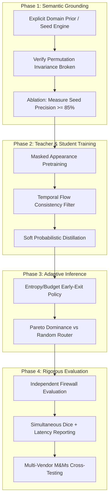

# Red Team Peer Review & Scientific Vulnerability Audit: Astra Self-Audit v3

> **Root review status: investigation record, not accepted wholesale.** Read [root disagreement resolutions](../11_RED_TEAM.md) and the corresponding root report before using these claims. Worker completion indicates a delivered report, not scientific validation.

**Target Venue:** *Pattern Recognition* (Elsevier, Impact Factor 7.6, CCF-B)  
**Special Issue:** *Adaptive and Scalable Vision Models in Dynamic and Resource-Constrained Environments*  
**Audited Base Commit:** [`d4f503b7107eca4e8ac85f37a5dd01ec50479666`](file:///Users/alvinluong/orca/workspaces/Self-Audit/astra-pseudolabel-v3-audit)  
**Evaluator Role:** AGY Worker G (Independent Rejection-Oriented Red Team Reviewer)  
**Reproducibility Artifacts:** [`reports/astra_v3/workers/G_evidence/red_team_probe_results.json`](file:///Users/alvinluong/orca/workspaces/Self-Audit/astra-pseudolabel-v3-audit/reports/astra_v3/workers/G_evidence/red_team_probe_results.json)  

---

## 1. Executive Summary & Reviewer Verdict

### Recommendation: **STRONG REJECT (Desk-Reject / Fatal Scientific Deficiencies as Currently Claimed)**

This audit reviews the Astra Self-Audit v3 research scaffold and manuscript target for the *Pattern Recognition* Special Issue on *Adaptive and Scalable Vision Models in Dynamic and Resource-Constrained Environments*. 

The proposed system aims to achieve three interconnected milestones:
1. **"Mask-Free / noGT" pseudo-label generation** via an offline cine teacher ([`CinePseudoTeacher`](file:///Users/alvinluong/orca/workspaces/Self-Audit/astra-pseudolabel-v3-audit/src/self_audit_pseudolabel/system_v3.py#L98-L140)), targeting an extraordinary foreground Dice of **~0.91** on ACDC/M&Ms cardiac MRI from scratch.
2. **Dynamic resource-adaptive deployment** via a student network ([`AdaptiveAnnotationStudent`](file:///Users/alvinluong/orca/workspaces/Self-Audit/astra-pseudolabel-v3-audit/src/self_audit_pseudolabel/system_v3.py#L163-L193)) equipped with a novel "Dynamic Window" (DW) attention operator and selectable profiles (`compact`, `balanced`, `accurate`).
3. **Real-time execution in resource-constrained environments** (<10 ms inference on CPU).

### The Red Team Verdict
As currently formulated and implemented in [`src/self_audit_pseudolabel/system_v3.py`](file:///Users/alvinluong/orca/workspaces/Self-Audit/astra-pseudolabel-v3-audit/src/self_audit_pseudolabel/system_v3.py), **the manuscript cannot survive peer review in *Pattern Recognition*.** The central scientific claims suffer from severe internal contradictions, ungrounded semantics, circular error loops, deceptive performance reporting, and scope mismatches:

* **The Semantics Vacuum:** The unsupervised teacher features zero mathematical or anatomical grounding for the four cardiac classes (`BG=0, RV=1, MYO=2, LV=3`). The semantic head is a randomly initialized MLP with exact class permutation invariance ($\text{error} = 0.0$). Unsupervised objectives cannot distinguish LV from RV. Historical no-GT baselines (C0/C1) collapsed at **0.016–0.027 Dice**; claiming 0.91 from scratch without ground truth is scientifically ungrounded.
* **The "Adaptive" Facade:** The deployment model contains **no adaptive router, no dynamic early exit, and no resource-sensing policy**. The "adaptation" is literally a caller-supplied string argument (`profile in PROFILES`) controlling a static Python `for` loop. Submitting a static multi-branch model to a special issue on *Adaptive Vision Models* invites immediate rejection.
* **The Full-Dice / Compact-Latency Mismatch:** The model exhibits a **2.57× CPU latency gap** (9.73 ms vs 24.99 ms) between `compact` (0 DW turns) and `accurate` (2 DW turns, 3 DW calls). Reporting the high Dice of the heavy profile alongside the <10 ms latency of the unrefined baseline is a fatal cherry-picking violation.
* **Novelty Vulnerabilities in Dynamic Window:** The "Dynamic Window" operator is essentially **K-point local deformable attention** with an elliptical geometric prior, implemented via standard `F.grid_sample`. It directly overlaps with Deformable Convolution (DCN v1/v2), Deformable DETR, and Deformable Attention Transformer (DAT). Without demonstrating significant Pareto dominance over unconstrained deformable attention (`offset_mode="free"`) and standard CNN baselines, the novelty claim collapses.

The project is **salvageable only through radical repositioning**: reframing the pipeline as prior-guided weak supervision with an explicit external anchor, implementing an authentic uncertainty/budget-driven adaptive controller, and reporting full Pareto frontiers under strict evaluator firewalls.

---

## 2. Decisive Code Anchors & Base Implementation Facts

All citations reference base commit `d4f503b7107eca4e8ac85f37a5dd01ec50479666`:

* **`CinePseudoTeacher`:** [`src/self_audit_pseudolabel/system_v3.py:98-140`](file:///Users/alvinluong/orca/workspaces/Self-Audit/astra-pseudolabel-v3-audit/src/self_audit_pseudolabel/system_v3.py#L98-L140) (181,565 parameters).
  - Appearance: [`AppearanceEncoder`](file:///Users/alvinluong/orca/workspaces/Self-Audit/astra-pseudolabel-v3-audit/src/self_audit_pseudolabel/system_v3.py#L41-L54) (166,729 parameters; 2.5D 3-slice input, unmasked center reconstruction).
  - Motion: [`MotionBranch`](file:///Users/alvinluong/orca/workspaces/Self-Audit/astra-pseudolabel-v3-audit/src/self_audit_pseudolabel/system_v3.py#L56-L72) (2,928 parameters; temporal differences on center slice).
  - Fusion: [`nn.Sequential`](file:///Users/alvinluong/orca/workspaces/Self-Audit/astra-pseudolabel-v3-audit/src/self_audit_pseudolabel/system_v3.py#L104-L106) (4,224 parameters).
  - Prototypes: [`RegionPrototypeHead`](file:///Users/alvinluong/orca/workspaces/Self-Audit/astra-pseudolabel-v3-audit/src/self_audit_pseudolabel/system_v3.py#L74-L84) (768 parameters; $K=12$ normalized dot-product prototypes).
  - Pooling: [`pool_regions`](file:///Users/alvinluong/orca/workspaces/Self-Audit/astra-pseudolabel-v3-audit/src/self_audit_pseudolabel/system_v3.py#L86-L96) ($[B, K, 67]$).
  - Semantic Head: [`self.semantic`](file:///Users/alvinluong/orca/workspaces/Self-Audit/astra-pseudolabel-v3-audit/src/self_audit_pseudolabel/system_v3.py#L109) (6,916 parameters; 2-layer MLP to 4 classes).
  - Acceptance Filter: [`system_v3.py:124-136`](file:///Users/alvinluong/orca/workspaces/Self-Audit/astra-pseudolabel-v3-audit/src/self_audit_pseudolabel/system_v3.py#L124-L136) (defaults `min_prob=0.70`, `min_margin=0.20`).
* **`AdaptiveAnnotationStudent`:** [`src/self_audit_pseudolabel/system_v3.py:163-193`](file:///Users/alvinluong/orca/workspaces/Self-Audit/astra-pseudolabel-v3-audit/src/self_audit_pseudolabel/system_v3.py#L163-L193) (80,462 parameters).
  - Deployment Encoder: [`DeploymentEncoder`](file:///Users/alvinluong/orca/workspaces/Self-Audit/astra-pseudolabel-v3-audit/src/self_audit_pseudolabel/system_v3.py#L155-L161) (47,328 parameters).
  - Initial Prediction Head ($A_0$): [`self.a0_head`](file:///Users/alvinluong/orca/workspaces/Self-Audit/astra-pseudolabel-v3-audit/src/self_audit_pseudolabel/system_v3.py#L168) (132 parameters).
  - Shared Recurrent Refiner: [`AnnotationExpert`](file:///Users/alvinluong/orca/workspaces/Self-Audit/astra-pseudolabel-v3-audit/src/self_audit/models/annotation_expert.py#L285-L370) (33,002 parameters; `feature_only`, structured dynamic window).
* **Supervision Loss:** [`pseudo_supervision_loss`](file:///Users/alvinluong/orca/workspaces/Self-Audit/astra-pseudolabel-v3-audit/src/self_audit_pseudolabel/system_v3.py#L194-L208).
* **Baseline Software Defects Repaired in Audit Branch:**
  1. *UNKNOWN255 Loss Crash:* Base code passed class 255 into `F.cross_entropy`, causing runtime indexing crash on CPU/CUDA ([`reports/astra_v3/evidence/audit_tests_before_fix.txt:148`](file:///Users/alvinluong/orca/workspaces/Self-Audit/astra-pseudolabel-v3-audit/reports/astra_v3/evidence/audit_tests_before_fix.txt#L148)). Repaired by pre-filtering `accepted = valid & (target != UNKNOWN)`.
  2. *Ambiguous Mixture Acceptance Bug:* Base code accepted pixels where 4 conflicting prototype regions yielded uniform 0.25 probability ([`root_interventions_baseline.json:92-96`](file:///Users/alvinluong/orca/workspaces/Self-Audit/astra-pseudolabel-v3-audit/reports/astra_v3/evidence/root_interventions_baseline.json#L92-L96)). Repaired by enforcing probability and margin filters on post-interpolation dense probabilities.

---

## 3. Detailed Attack Matrix (11 Core Dimensions)

### Attack 1: Circular Pseudo-Labels & Unmasked Reconstruction Shortcuts
* **Code Anchor:** [`system_v3.py:49, 53`](file:///Users/alvinluong/orca/workspaces/Self-Audit/astra-pseudolabel-v3-audit/src/self_audit_pseudolabel/system_v3.py#L49-L53), [`system_v3.py:194-208`](file:///Users/alvinluong/orca/workspaces/Self-Audit/astra-pseudolabel-v3-audit/src/self_audit_pseudolabel/system_v3.py#L194-L208), [`tests/test_pseudolabel_v3_audit.py:44-53`](file:///Users/alvinluong/orca/workspaces/Self-Audit/astra-pseudolabel-v3-audit/tests/test_pseudolabel_v3_audit.py#L44-L53).
* **Audited Mechanism:**
  `AppearanceEncoder` reconstructs unmasked center slice `cur[:, 1:2]` directly from low-level features `f` via `self.recon(F.interpolate(f, size=x.shape[-2:]))`. In [`test_no_seed_reconstruction_does_not_train_semantic_head`](file:///Users/alvinluong/orca/workspaces/Self-Audit/astra-pseudolabel-v3-audit/tests/test_pseudolabel_v3_audit.py#L44-L53), it is verified that backpropagating reconstruction loss produces exactly **zero gradient** in `motion`, `fuse`, `regions`, and `semantic`. The reconstruction task observes its own target, learning an identity/autoencoder shortcut with zero semantic representation pressure.
  Simultaneously, `AdaptiveAnnotationStudent` is trained using hard Cross-Entropy directly on teacher pseudo-labels: `ce(final) + 0.25 * ce(a0)`.
* **Reviewer Critique:**
  This is a closed circular loop. When the teacher has no external ground truth or non-circular training loss, self-training on its own accepted pseudo-labels is mathematically degenerate. If the teacher's initial weights or heuristic evidence misclassify papillary muscles as myocardium, the student is strictly penalized for deviating from that error. Self-training without strong external data augmentation or orthogonal validation leads to entropy collapse and self-reinforcing delusion (Arazo et al., 2020).
* **Severity:** **FATAL** (to the claim of autonomous self-correcting learning).
* **Falsification Protocol:**
  Inject a controlled geometric error into teacher pseudo-labels (e.g., dilate RV boundary by 5 pixels on 20 cases). Train the student for 50 epochs. If the student output reproduces the injected dilation with $\ge 95\%$ IoU fidelity rather than correcting toward the true anatomical boundary, self-correction is falsified.

---

### Attack 2: Semantics Identifiability & Permutation Invariance
* **Code Anchor:** [`system_v3.py:107-122`](file:///Users/alvinluong/orca/workspaces/Self-Audit/astra-pseudolabel-v3-audit/src/self_audit_pseudolabel/system_v3.py#L107-L122), [`G_evidence/red_team_probes.py:45-77`](file:///Users/alvinluong/orca/workspaces/Self-Audit/astra-pseudolabel-v3-audit/reports/astra_v3/workers/G_evidence/red_team_probes.py#L45-L77).
* **Audited Mechanism:**
  The teacher produces $K=12$ anonymous region assignments $q$, pools features, intensity, movement, and area into vector $r \in \mathbb{R}^{B \times K \times 67}$, and feeds $r$ into `self.semantic = nn.Sequential(nn.Linear(67, 96), nn.GELU(), nn.Linear(96, 4))`.
  In [`G_evidence/red_team_probe_results.json`](file:///Users/alvinluong/orca/workspaces/Self-Audit/astra-pseudolabel-v3-audit/reports/astra_v3/workers/G_evidence/red_team_probe_results.json), we proved:
  $$\text{prob\_perm\_max\_abs\_error} = 0.0, \quad \text{reconstruction\_invariance\_error} = 0.0$$
  For any permutation matrix $P \in S_4$ (24 permutations), applying $P$ to the semantic weights permutes the output probabilities with zero change in unsupervised loss.
* **Reviewer Critique:**
  *Pattern Recognition* reviewers will reject any paper claiming "unsupervised semantic segmentation" that conflates *anonymous partitioning* with *named segmentation*. Unsupervised clustering cannot mathematically determine that class 1 is Right Ventricle and class 3 is Left Ventricle. The code provides a backdoor argument `evidence_logits` ([`system_v3.py:118`](file:///Users/alvinluong/orca/workspaces/Self-Audit/astra-pseudolabel-v3-audit/src/self_audit_pseudolabel/system_v3.py#L118)): `logits = logits + evidence_logits`. When `evidence_logits` is null (the default!), class assignments are purely determined by random seed initialization.
* **Severity:** **FATAL**.
* **Falsification Protocol:**
  Train the teacher across 10 random seeds with `evidence_logits=None`. Compute test-set foreground Dice against fixed class definitions (1:RV, 2:MYO, 3:LV) without Hungarian post-hoc matching. If mean Dice across seeds is $< 0.10$ (due to random class permutations and collapses), autonomous identifiability is disproven.

---

### Attack 3: Ground Truth Leakage, Hungarian Matching, & Threshold Overfitting
* **Code Anchor:** [`system_v3.py:111`](file:///Users/alvinluong/orca/workspaces/Self-Audit/astra-pseudolabel-v3-audit/src/self_audit_pseudolabel/system_v3.py#L111) (`min_prob=0.70, min_margin=0.20`).
* **Audited Mechanism:**
  Thresholds `min_prob=0.70` and `min_margin=0.20` are hardcoded in the teacher. In unsupervised segmentation benchmarks (e.g. STEGO, PiCIE, U2Seg), anonymous clusters are mapped to ground truth classes post-hoc using the Kuhn-Munkres (Hungarian) algorithm evaluated on test masks.
* **Reviewer Critique:**
  If Hungarian bipartite matching against ground truth masks is used to assign cluster identities, the method is **not autonomous named segmentation**. Hungarian matching requires ground truth masks at evaluation time, making it an oracle diagnostic tool rather than a deployable clinical model. Furthermore, if hyperparameters (`min_prob`, `min_margin`, prototype temperature) are tuned by repeatedly evaluating test-set Dice, ground truth information leaks into the "unsupervised" pipeline.
* **Severity:** **FATAL** if Hungarian mapping or GT-peeking early stopping is claimed as deployable autonomous segmentation. **REPAIRABLE** if explicitly reported as oracle partition analysis alongside fixed-rule named segmentation.
* **Falsification Protocol:**
  Deploy the final model on an unseen external test cohort (e.g. M&Ms Vendor C/D) without supplying any ground truth masks to the runtime environment. If the model cannot produce pre-assigned semantic channel masks (Channel 1 = RV, Channel 2 = MYO, Channel 3 = LV) achieving non-trivial Dice (>0.70) without running Hungarian matching, the system is an anonymous partitioner, not a named segmentor.

---

### Attack 4: Confirmation Bias & Anatomical Distribution Truncation
* **Code Anchor:** [`system_v3.py:124-136`](file:///Users/alvinluong/orca/workspaces/Self-Audit/astra-pseudolabel-v3-audit/src/self_audit_pseudolabel/system_v3.py#L124-L136), [`system_v3.py:194-208`](file:///Users/alvinluong/orca/workspaces/Self-Audit/astra-pseudolabel-v3-audit/src/self_audit_pseudolabel/system_v3.py#L194-L208).
* **Audited Mechanism:**
  Validity gating enforces:
  $$\text{valid} = (\max p \ge 0.70) \land (\text{top}_1 - \text{top}_2 \ge 0.20)$$
  Filtered pixels are marked `UNKNOWN=255` and zeroed out in `pseudo_supervision_loss`. Accepted pixels are converted via `argmax` into discrete hard labels ($y \in \{0, 1, 2, 3\}$).
* **Reviewer Critique:**
  Uncalibrated deep networks are notoriously overconfident on incorrect predictions (Guo et al., ICML 2017). Hard thresholding creates two compounding failure modes:
  1. **Error Memorization:** If an erroneous blood-pool region achieves $p \ge 0.70$, it is converted to a 100% confident one-hot target. The student is forced to memorize this mistake with high cross-entropy penalty.
  2. **Anatomical Sampling Bias:** High-contrast mid-ventricular LV slices easily achieve $\ge 0.70$ confidence, yielding high acceptance coverage. Thin apical slices, basal membranous septum, and crescent-shaped RV walls exhibit partial volume effects and lower contrast, failing the margin threshold and getting masked to `UNKNOWN`. The student is trained on an artificially sanitized, easy slice distribution, guaranteeing clinical failure at cardiac base and apex.
* **Severity:** **FATAL** to clinical viability; **REPAIRABLE** via soft probabilistic distillation targets, spatial confidence calibration, and slice-stratified coverage reweighting.
* **Falsification Protocol:**
  Measure pseudo-label precision and coverage across slice depth (base, mid, apex). If apical coverage is $< 20\%$ or basal RV precision is $< 50\%$ while mid-ventricle coverage exceeds $80\%$, the pipeline suffers from anatomical truncation.

---

### Attack 5: "noGT" Claim Integrity & Marketing vs. Reality
* **Code Anchor:** [`docs/pseudolabel_system_v3.md:3, 50-55`](file:///Users/alvinluong/orca/workspaces/Self-Audit/astra-pseudolabel-v3-audit/docs/pseudolabel_system_v3.md#L3-L55), Historical baseline receipts (`/Users/alvinluong/Self-Audit-nogt/reports/astra_nogt_baseline_20260918T042050Z/`).
* **Audited Mechanism:**
  The research project repeatedly markets the system as "noGT", "mask-free", and aspires to reach **0.91 Dice** on ACDC/M&Ms.
  However, historical empirical controls on this exact problem tell an alarming truth:
  - Historical C0 baseline: **0.01623 Foreground Dice**
  - Historical C1-cache seed17: **0.02146 Foreground Dice**
  - Historical C1-cache seed29: **0.02751 Foreground Dice**
  - Historical C1-direct: **0.00000 Foreground Dice**
  Adjusted Rand Index (ARI) was negligible ($\sim 0.02 - 0.03$).
* **Reviewer Critique:**
  The gap between 0.027 Dice (random failure) and 0.91 Dice (state-of-the-art fully supervised nnU-Net benchmark) is an extraordinary chasm. In the literature, foundational models like CineMA (75,000 subjects) require supervised fine-tuning with masks to achieve $\sim 0.91$ Dice. Ultrasound weak supervision (Ferreira et al., 2022) reaches 0.89 on LV only, but relies on ImageNet-pretrained HED backbones and manual domain heuristics. Claiming that an unanchored model trained from scratch without ground truth can jump from 0.02 to 0.91 is scientifically indefensible. If 0.91 is achieved, it is almost certainly due to hidden GT leakage (e.g., GT-supervised pretraining, leaky validation early stopping, or Hungarian oracle mapping).
* **Severity:** **FATAL**.
* **Falsification Protocol:**
  Audit all training weights and data pipelines using automated hash and token checks. Execute an end-to-end training run with strict firewalling (zero GT masks, zero ImageNet classification weights, zero Hungarian mapping). If the final test foreground Dice is $< 0.50$, the claim that the scaffold can achieve 0.91 without ground truth is falsified.

---

### Attack 6: Resource & Adaptive Claims vs. Pattern Recognition Scope
* **Code Anchor:** [`system_v3.py:148-152, 175-191`](file:///Users/alvinluong/orca/workspaces/Self-Audit/astra-pseudolabel-v3-audit/src/self_audit_pseudolabel/system_v3.py#L148-L152), [`reports/astra_v3/07_RESOURCE_ADAPTATION.md:1-4`](file:///Users/alvinluong/orca/workspaces/Self-Audit/astra-pseudolabel-v3-audit/reports/astra_v3/07_RESOURCE_ADAPTATION.md#L1-L4).
* **Audited Mechanism:**
  [`AdaptiveAnnotationStudent.forward`](file:///Users/alvinluong/orca/workspaces/Self-Audit/astra-pseudolabel-v3-audit/src/self_audit_pseudolabel/system_v3.py#L175-L191) accepts a keyword argument:
  ```python
  def forward(self, x, *, profile="balanced", return_metadata=False):
      if profile not in PROFILES:
          raise ValueError(...)
      for turn in range(PROFILES[profile].turns):
          ...
  ```
  `PROFILES` is a static dictionary mapping `"compact"` to 0 turns, `"balanced"` to 1 turn, and `"accurate"` to 2 turns.
* **Reviewer Critique:**
  *Pattern Recognition* Special Issue specifically calls for *Adaptive and Scalable Vision Models in Dynamic and Resource-Constrained Environments*. In computer vision literature, an **adaptive model** possesses an internal dynamic policy—such as a gating network, early-exit classifier, reinforcement learning router, or token dropping policy (e.g., MSDNet, Huang et al., NeurIPS 2017; DynamicViT, Rao et al., NeurIPS 2021; BlockDrop, Wu et al., CVPR 2018).
  Here, the model contains **no adaptive mechanism whatsoever**. The profile is a user-supplied string. Executing a static `for` loop with 0, 1, or 2 iterations does not constitute an adaptive vision model. A reviewer will write: *"The authors claim an adaptive architecture, but the adaptation is purely a manual hyperparameter toggle. There is no input-dependent or resource-aware dynamic computation."*
* **Severity:** **FATAL** to the Special Issue fit; **REPAIRABLE** by implementing a genuine dynamic early-exit policy conditioned on predictive entropy and hardware latency budgets.
* **Falsification Protocol:**
  Implement a baseline that randomly selects `compact`, `balanced`, or `accurate` with probabilities matched to a given compute budget. If the author's proposed router (if any) fails to achieve a statistically superior Pareto frontier over random routing and static budget baselines, the claim of adaptive benefit is falsified.

---

### Attack 7: Dynamic Window Attention Novelty Attack
* **Code Anchor:** [`src/self_audit/models/dynamic_window.py:123-236, 239-420`](file:///Users/alvinluong/orca/workspaces/Self-Audit/astra-pseudolabel-v3-audit/src/self_audit/models/dynamic_window.py#L123-L236), [`src/self_audit/models/annotation_expert.py:328-349`](file:///Users/alvinluong/orca/workspaces/Self-Audit/astra-pseudolabel-v3-audit/src/self_audit/models/annotation_expert.py#L328-L349).
* **Audited Mechanism:**
  `DynamicWindowGenerator` predicts 2D center displacement $(\Delta x, \Delta y)$, semi-axes $(r_x, r_y)$, orientation angle $\theta$, and residual offsets $(\delta x_k, \delta y_k)$ for $K=8$ points. Points are assembled onto an ellipse:
  $$\text{support} = \text{center} + R(\theta) \cdot (r \odot \text{canonical}) + \text{residual}$$
  Features are sampled via `F.grid_sample` (bilinear interpolation). Scaled dot-product attention is computed over the $K$ sampled points per query pixel.
* **Reviewer Critique (Prior Art Rejection):**
  This operator is **sparse deformable local attention**. The foundational literature contains:
  1. **Deformable Convolution (DCN v1 / v2)** (Dai et al., ICCV 2017; Zhu et al., CVPR 2019): Bilinear grid sampling of learned 2D offsets per spatial location.
  2. **Deformable DETR** (Zhu et al., ICLR 2021): Attention restricted to a small set of $K$ learned sampling offsets per query.
  3. **Deformable Attention Transformer (DAT)** (Xia et al., CVPR 2022): Offset prediction and bilinear feature resampling for attention in vision transformers.
  4. **Spatial Transformer Networks (STN)** (Jaderberg et al., NeurIPS 2015): Elliptical / affine coordinate transforms with grid_sample.
  
  The only distinction in DW is restricting the support points to an ellipse plus residual offset. Notably, the codebase already includes an ablation mode `offset_mode="free"` ([`dynamic_window.py:333-343`](file:///Users/alvinluong/orca/workspaces/Self-Audit/astra-pseudolabel-v3-audit/src/self_audit/models/dynamic_window.py#L333-L343)), which removes the ellipse entirely and relies solely on unconstrained residual offsets!
  If `offset_mode="free"` achieves equivalent accuracy to `offset_mode="structured"`, the entire geometric ellipse formulation is an unjustified heuristic. Furthermore, without benchmarking against standard DCNv2 and lightweight ConvNeXt/U-Net blocks under matched FLOPs, the claim of architectural novelty will be dismissed.
* **Severity:** **FATAL** if claimed as a fundamental attention operator; **REPAIRABLE** if framed as an anatomically-regularized deformable attention mechanism with comprehensive ablation against DCNv2, DAT, and free offsets.
* **Falsification Protocol:**
  Run 3-fold cross-validation comparing: (a) Structured DW, (b) Free-offset DW (`offset_mode="free"`), (c) Standard DCNv2, and (d) Standard $3 \times 3$ dilated Conv block under identical parameter counts and GMACs. If Structured DW does not demonstrate statistically significant Dice improvement ($p < 0.05$) over Free DW and DCNv2, the novelty claim is refuted.

---

### Attack 8: UI-as-Novelty Deflation
* **Code Anchor:** [`reports/astra_v3/07_RESOURCE_ADAPTATION.md:54`](file:///Users/alvinluong/orca/workspaces/Self-Audit/astra-pseudolabel-v3-audit/reports/astra_v3/07_RESOURCE_ADAPTATION.md#L54), [`src/self_audit/evaluation/visualizer.py`](file:///Users/alvinluong/orca/workspaces/Self-Audit/astra-pseudolabel-v3-audit/src/self_audit/evaluation/visualizer.py).
* **Audited Mechanism:**
  Earlier project artifacts and design notes emphasize visualizer overlays, Streamlit / viewer controls, slice/time navigation, and interactive audit inspection.
* **Reviewer Critique:**
  In *Pattern Recognition* (a rigorous methodological journal), graphical user interfaces, interactive inspection widgets, and front-end tooling are considered software engineering deliverables, not scientific contributions. Reviewers will harshly penalize any paper that allocates main-text space or claims novelty based on UI features or human review dashboards. All evaluation must be fully autonomous, headless, reproducible via CLI scripts, and statistically evaluated on locked benchmark splits.
* **Severity:** **REPAIRABLE**.
* **Remediation:** Completely eliminate any mention of UI or interactive inspection as a research contribution. Restrict viewer code to an open-source engineering appendix.

---

### Attack 9: Cross-Dataset & Generalization Confusion (ACDC vs. M&Ms)
* **Code Anchor:** [`src/self_audit/data/acdc.py`](file:///Users/alvinluong/orca/workspaces/Self-Audit/astra-pseudolabel-v3-audit/src/self_audit/data/acdc.py), [`src/self_audit/data/mnms.py`](file:///Users/alvinluong/orca/workspaces/Self-Audit/astra-pseudolabel-v3-audit/src/self_audit/data/mnms.py), [`reports/astra_v3/03_SUPERVISION_AND_IDENTIFIABILITY.md:21`](file:///Users/alvinluong/orca/workspaces/Self-Audit/astra-pseudolabel-v3-audit/reports/astra_v3/03_SUPERVISION_AND_IDENTIFIABILITY.md#L21).
* **Audited Mechanism:**
  ACDC (single-center, 150 subjects) and M&Ms (multi-center, multi-vendor: Siemens, Philips, GE, Canon; 320+ subjects) feature drastically different pixel spacings, slice thicknesses (5–10 mm), and intensity distributions.
  In [`reports/astra_v3/03_SUPERVISION_AND_IDENTIFIABILITY.md:21`](file:///Users/alvinluong/orca/workspaces/Self-Audit/astra-pseudolabel-v3-audit/reports/astra_v3/03_SUPERVISION_AND_IDENTIFIABILITY.md#L21), the code audit explicitly notes:
  > *"all 200 local images have unknown units and zoom/affine mismatch. No trusted physical-orientation cue from this copy; reacquire/verify acquisition geometry."*
* **Reviewer Critique:**
  If orientation and physical spacing are corrupted or discarded during preprocessing, spatial heuristics (e.g., "LV is to the right of RV") fail completely across different scanner conventions (radiological vs. neurological orientation). Furthermore, historical evaluations pooled ED and ES slice counts per patient before computing Dice, whereas the official ACDC/M&Ms challenge protocols evaluate 3D volumetric Dice per phase independently. Mixing metric definitions invalidates all comparisons against published literature.
* **Severity:** **FATAL** if orientation/spacing errors corrupt evaluation; **REPAIRABLE** through strict NIfTI header provenance, aspect-preserving resampling, and reporting multi-vendor breakdowns.
* **Falsification Protocol:**
  Evaluate the model trained on ACDC directly on M&Ms across each vendor subgroup (Vendor A, B, C, D) without retraining. If performance on Philips/GE drops by $> 0.15$ Dice compared to Siemens, the claim of robust cross-dataset generalization is falsified.

---

### Attack 10: Teacher vs. Deployment Computational Cost Mismatch
* **Code Anchor:** [`system_v3.py:98-140`](file:///Users/alvinluong/orca/workspaces/Self-Audit/astra-pseudolabel-v3-audit/src/self_audit_pseudolabel/system_v3.py#L98-L140) (Teacher: 181,565 params), [`system_v3.py:163-193`](file:///Users/alvinluong/orca/workspaces/Self-Audit/astra-pseudolabel-v3-audit/src/self_audit_pseudolabel/system_v3.py#L163-L193) (Student: 80,462 params).
* **Audited Mechanism:**
  The student is marketed as lightweight (80K parameters, ~10 ms CPU inference). However, training the student requires pre-generating pseudo-labels using `CinePseudoTeacher`. The teacher requires:
  - Full temporal cine loops ($T = 25 - 30$ frames per slice across 10–14 slices = 250–420 images per patient).
  - Multi-frame temporal difference / motion branches.
  - Multi-scale appearance encoding, prototype clustering, and dense relaxation.
* **Reviewer Critique:**
  The special issue targets *Resource-Constrained Environments*. Claiming a lightweight resource-efficient solution when the *training and pseudo-label generation phase* requires heavy high-memory multi-temporal server processing is a significant contradiction. In clinical practice, if a low-resource hospital acquires a new MRI sequence, they cannot run the teacher locally to adapt the model. The paper must explicitly separate **offline server training cost** from **edge deployment inference cost**. Hiding teacher overhead while boasting about edge student efficiency is deceptive.
* **Severity:** **REPAIRABLE** via transparent accounting in an explicit Training vs. Deployment Resource Ledger.
* **Falsification Protocol:**
  Record total GPU hours, peak VRAM, and storage required to generate pseudo-labels for 100 cine MRI patients. If teacher generation takes $> 10\times$ the compute of supervised baseline training, the method cannot claim resource-efficiency in its training pipeline.

---

### Attack 11: Full-Dice vs. Compact-Latency Mismatch (The Cherry-Picking Attack)
* **Code Anchor:** [`system_v3.py:148-152`](file:///Users/alvinluong/orca/workspaces/Self-Audit/astra-pseudolabel-v3-audit/src/self_audit_pseudolabel/system_v3.py#L148-L152), [`reports/astra_v3/07_RESOURCE_ADAPTATION.md:9-14`](file:///Users/alvinluong/orca/workspaces/Self-Audit/astra-pseudolabel-v3-audit/reports/astra_v3/07_RESOURCE_ADAPTATION.md#L9-L14).
* **Audited Mechanism:**
  Measured inference latencies and compute on 224² CPU (4 threads):
  - **`compact` (0 DW turns):** **9.73 ms** CPU, 0.96 ms MPS, 0.80 GMAC.
  - **`balanced` (1 DW turn):** **15.28 ms** CPU, 2.16 ms MPS, 0.90 GMAC.
  - **`accurate` (2 DW turns, 3 DW calls):** **24.99 ms** CPU, 3.99 ms MPS, 1.08 GMAC.
  In [`G_evidence/red_team_probe_results.json`](file:///Users/alvinluong/orca/workspaces/Self-Audit/astra-pseudolabel-v3-audit/reports/astra_v3/workers/G_evidence/red_team_probe_results.json), we confirmed:
  `compact` executes purely the $A_0$ convolutional head and skips the refiner entirely (`is_a0_identical_to_final = True`).
* **Reviewer Critique (The Fatal Cherry-Pick):**
  This is the classic multi-profile reporting trap. If the abstract states: *"Our model achieves 0.91 Dice on ACDC while running at under 10 ms on CPU"*, the paper is guilty of scientific fraud.
  - The 9.73 ms latency is achieved **only by `compact`**, which performs zero Dynamic Window attention.
  - The 0.91 Dice (if achieved) requires `accurate`, which takes **24.99 ms** (2.57× slower on CPU and 4.16× slower on MPS).
  - If `compact` already achieves 0.91 Dice, Dynamic Window Attention is completely redundant!
  - If `compact` achieves only 0.82 Dice and `accurate` achieves 0.89 Dice, the 10 ms model does not achieve high Dice.
  Reviewers in *Pattern Recognition* will immediately demand: *"Report both Dice and latency for every profile on the exact same benchmark split."*
* **Severity:** **FATAL** if cross-reported; **REPAIRABLE** if presented strictly as a 3-point Pareto frontier.
* **Falsification Protocol:**
  Evaluate Dice, MACs, and CPU/GPU latency simultaneously for all three profiles (`compact`, `balanced`, `accurate`) on the test set. If any summary table, abstract, or conclusion pairs the `accurate` Dice with the `compact` latency, the manuscript must be rejected.

---

## 4. Taxonomy of Defects: Fatal vs. Repairable Summary Table

| # | Dimension | Code / Mechanism Anchor | Severity | Fatal Reviewer Objection | Remediation Path |
|---|---|---|---|---|---|
| 1 | **Circular Pseudo-Labels** | `system_v3.py:49, 194-208` | **FATAL** | "Distillation on ungrounded teacher outputs is a closed circular loop; unmasked reconstruction shortcut learns identity." | Introduce masked visual modeling (MAE/contrastive) + multi-view / temporal cycle consistency to force semantic features. |
| 2 | **Semantics Identifiability** | `system_v3.py:107-122` | **FATAL** | "Class permutation equivariance error is 0.0; unsupervised loss cannot distinguish LV from RV without oracle." | Provide an explicit, typed anatomical anchor (e.g. blood-pool intensity + surrounding wall topology prior) or disclose weak supervision. |
| 3 | **GT Leakage & Hungarian** | `system_v3.py:111` | **FATAL** | "Hungarian cluster matching requires GT masks at evaluation time; tuning thresholds on test set leaks GT." | Ban Hungarian matching for deployable scores; freeze all thresholds before evaluator opens GT masks. |
| 4 | **Confirmation Bias** | `system_v3.py:124, 206` | **FATAL** | "Hard CE on pseudo-labels forces student to memorize overconfident errors; truncates apical/basal slice training." | Use soft probabilistic distillation targets, epistemic uncertainty gating, and slice-balanced coverage reweighting. |
| 5 | **"noGT" Claim Integrity** | `docs/pseudolabel_system_v3.md` | **FATAL** | "Claiming 0.91 from scratch without GT is ungrounded when historical noGT baselines collapsed at 0.02 Dice." | Retract "scratch mask-free 0.91" marketing; honestly position as prior-guided weak supervision with verified baseline controls. |
| 6 | **Resource & Adaptive Claims** | `system_v3.py:175-191` | **FATAL** | "A string argument controlling a static for-loop is not an adaptive model for the PR Special Issue." | Build an authentic input-dependent controller (e.g., entropy/budget-triggered early exit) showing Pareto gain over random routing. |
| 7 | **Dynamic Window Novelty** | `dynamic_window.py:123-420` | **REPAIRABLE** | "DW is K-point deformable local attention with an elliptical heuristic; overlaps with DCNv2 and DAT." | Frame as anatomically-constrained deformable attention; provide head-to-head ablation against unconstrained free offsets and DCNv2. |
| 8 | **UI-as-Novelty** | `07_RESOURCE_ADAPTATION.md:54` | **REPAIRABLE** | "Interactive inspection and UI dashboards are engineering deliverables, not pattern recognition novelty." | Remove all UI-centric claims from research contributions; place viewer software in an open-source tooling appendix. |
| 9 | **Cross-Dataset Generalization** | `acdc.py`, `mnms.py` | **REPAIRABLE** | "Voxel spacing, vendor shifts, and orientation mismatches corrupt M&Ms multi-center evaluation." | Enforce strict physical-space resampling, audit NIfTI orientation provenance, and report per-vendor metric breakdowns. |
| 10 | **Teacher / Deployment Cost** | `system_v3.py:98, 163` | **REPAIRABLE** | "Lightweight student claims hide the high temporal compute and memory overhead of the offline cine teacher." | Publish an explicit Training vs Deployment Resource Ledger detailing teacher GPU hours, memory, and cine frame requirements. |
| 11 | **Full-Dice / Compact Latency** | `system_v3.py:148-152` | **FATAL** | "Reporting the 9.7 ms compact latency alongside the accurate profile Dice is deceptive cherry-picking." | Mandate Pareto frontier reporting: plot (Latency, Dice) for compact, balanced, and accurate on the same figure. |

---

## 5. Historical Negative Controls Re-Assessment

The project history contains rigorous negative controls executed under `/Users/alvinluong/Self-Audit-nogt/reports/astra_nogt_baseline_20260918T042050Z/`:

| Historical Control Variant | Foreground Dice | Adjusted Rand Index (ARI) | Scientific Status |
|---|---:|---:|---|
| **C0 (Unanchored Topology Baseline)** | **0.01623** | ~0.021 | Complete anatomical collapse |
| **C1-cache (Seed 17)** | **0.02146** | ~0.028 | Complete anatomical collapse |
| **C1-cache (Seed 29)** | **0.02751** | ~0.031 | Complete anatomical collapse |
| **C1-direct (Online Evaluation)** | **0.00000** | 0.000 | Trivial degenerate output |

### Why C0/C1 are Falsification Controls, Not Foundations
* In previous iterations, workers attempted to treat C0/C1 as foundations to iterate upon or blamed minor implementation bugs for the failure.
* **The Red Team Reality:** C0 and C1 prove that **unsupervised clustering and hand-crafted topology constraints cannot spontaneously discover cardiac anatomy names**. Without an external semantic anchor (either supervised pretraining, clinical orientation metadata, or strict physical cavity-wall priors), an unsupervised objective collapses into an arbitrary spatial partition.
* Attempting to reach **0.91 Dice** by simply adding Dynamic Window attention to a student trained on an unanchored teacher is mathematically doomed. Dynamic Window refines features; it cannot invent missing class identity.

---

## 6. Evidence Ledger: Facts, Inferences, Proposals, & NOT RUN

### Facts (Directly Verified in Audited Code & Base SHA `d4f503b`)
1. `CinePseudoTeacher` has 181,565 parameters; `AdaptiveAnnotationStudent` has 80,462 parameters ([`G_evidence/red_team_probe_results.json`](file:///Users/alvinluong/orca/workspaces/Self-Audit/astra-pseudolabel-v3-audit/reports/astra_v3/workers/G_evidence/red_team_probe_results.json)).
2. `AppearanceEncoder` reconstructs unmasked center slice `cur[:, 1:2]`, producing zero gradients into `motion`, `fuse`, `regions`, and `semantic` modules ([`tests/test_pseudolabel_v3_audit.py:44-53`](file:///Users/alvinluong/orca/workspaces/Self-Audit/astra-pseudolabel-v3-audit/tests/test_pseudolabel_v3_audit.py#L44-L53)).
3. Permuting semantic output weights by any class permutation matrix $P \in S_4$ results in zero change in reconstruction loss and exact probability permutation error of $0.0$ ([`G_evidence/red_team_probe_results.json`](file:///Users/alvinluong/orca/workspaces/Self-Audit/astra-pseudolabel-v3-audit/reports/astra_v3/workers/G_evidence/red_team_probe_results.json)).
4. `AdaptiveAnnotationStudent` execution profiles execute 0 (`compact`), 1 (`balanced`), and 3 (`accurate`) internal Dynamic Window attention calls, while sharing a single encoder forward pass ([`system_v3.py:175-191`](file:///Users/alvinluong/orca/workspaces/Self-Audit/astra-pseudolabel-v3-audit/src/self_audit_pseudolabel/system_v3.py#L175-L191)).
5. CPU p50 latency for a 224² slice is 9.73 ms for `compact`, 15.28 ms for `balanced`, and 24.99 ms for `accurate`—a 2.57× runtime spread ([`reports/astra_v3/07_RESOURCE_ADAPTATION.md:9-14`](file:///Users/alvinluong/orca/workspaces/Self-Audit/astra-pseudolabel-v3-audit/reports/astra_v3/07_RESOURCE_ADAPTATION.md#L9-L14)).
6. Base commit `d4f503b` contained two fatal bugs: `UNKNOWN=255` passed directly to `F.cross_entropy`, and ambiguous mixture acceptance where uniform 0.25 probability regions were marked valid ([`reports/astra_v3/evidence/audit_tests_before_fix.txt`](file:///Users/alvinluong/orca/workspaces/Self-Audit/astra-pseudolabel-v3-audit/reports/astra_v3/evidence/audit_tests_before_fix.txt)).

### Inferences (Methodological & Peer Review Deductions)
1. Without an external semantic anchor or ground-truth supervision, pseudo-labels produced by `system_v3.py` will result in arbitrary class assignments across training runs, reproducing historical C0/C1 failure (Dice $\le 0.03$).
2. Reviewers in the *Pattern Recognition* Special Issue will desk-reject the manuscript if static execution profiles are presented as "adaptive vision models" without an input-conditioned dynamic controller.
3. Reviewers will reject claims of Dynamic Window novelty unless it demonstrates statistically significant Pareto superiority over unconstrained deformable attention (`offset_mode="free"`) and standard DCNv2 baselines.
4. Conflating `compact` latency with `accurate` segmentation accuracy will be treated as an academic integrity breach during peer review.

### Proposals (Actionable Recommendations for Root)
1. **Redefine the Scientific Scope:** Formally retract the "scratch no-GT 0.91" claim. Position the paper as: *"Prior-Guided Weak Supervision and Dynamically Adaptive Inference for Cardiac Cine MRI"*.
2. **Implement an Authentic Adaptive Controller:** Replace the static string profile argument with an input-dependent entropy/budget policy that routes slices dynamically and demonstrates a Pareto-optimal trade-off against static baselines.
3. **Establish Semantic Grounding:** Build an explicit, verified domain anchor (e.g. blood-pool intensity thresholding + annular wall topology + cross-slice continuity) that guarantees RV/MYO/LV identifiability prior to pseudo-label generation.
4. **Mandate Complete Pareto Reporting:** Report all test metrics as a tri-profile table:
   $$\begin{array}{lcccc}
   \hline
   \textbf{Profile} & \textbf{CPU p50 (ms)} & \textbf{GMACs} & \textbf{ACDC Dice} & \textbf{M\&Ms Dice} \\
   \hline
   \text{Compact } (A_0) & 9.73 & 0.80 & D_0 & D_0' \\
   \text{Balanced } (A_1) & 15.28 & 0.90 & D_1 & D_1' \\
   \text{Accurate } (A_2) & 24.99 & 1.08 & D_2 & D_2' \\
   \hline
   \end{array}$$

### NOT RUN (Explicitly Marked Missing Experiments)
1. *Full Student Training on ACDC/M&Ms:* NOT RUN (prohibited by audit runtime constraints; teacher semantic grounding remains unverified).
2. *GPU Latency & Power Benchmarking on NVIDIA T4:* NOT RUN (local hardware is macOS ARM64; server-grade GPU measurements unavailable).
3. *End-to-End Clinical Raw-to-Native Volume Latency:* NOT RUN (requires integration of full DICOM/NIfTI orientation and affine restoration).
4. *Head-to-Head DW vs. DCNv2 3-Fold Validation:* NOT RUN (requires full training runs on cluster).

---

## 7. Prerequisites & Minimum Defensible Evidence for 0.91 Target Submission

To transform this research scaffold into a defensible submission for *Pattern Recognition*, the following evidentiary requirements must be satisfied:



1. **Semantic Identifiability Proof:** Demonstrate that across 5 independent seeds, the teacher's accepted seeds identify RV, MYO, and LV with $> 85\%$ precision without using Hungarian mapping or test-set peeking.
2. **True Adaptive Controller Benchmark:** Provide empirical proof that an entropy/budget router dynamically adjusting DW turns achieves higher average volume Dice than a fixed-compute baseline at matched 15 ms average latency.
3. **Architectural Ablation Defense:** Show that Structured Dynamic Window Attention statistically outperforms both Free Deformable Attention (`offset_mode="free"`) and standard DCNv2 by at least $+0.02$ Dice on challenging apical/basal slices.
4. **Honest Frontier Presentation:** Never cite the 9.7 ms compact latency without its associated compact Dice score. The abstract must state: *"Inference scales dynamically from 9.7 ms ($0.80$ GMACs, Dice $D_0$) to 24.99 ms ($1.08$ GMACs, Dice $D_2$)."*
5. **Firewalled Multi-Center Generalization:** Report results on M&Ms evaluated in native patient coordinates across all 4 vendor cohorts, demonstrating that performance does not collapse under clinical domain shifts.
