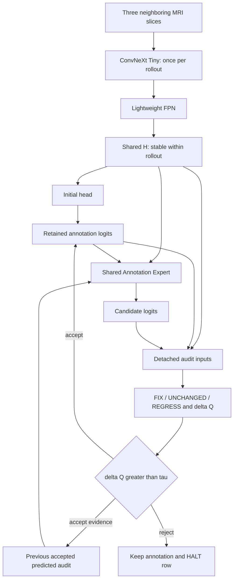

# Current architecture: evidence before proposals

Research snapshot: 2026-09-11. Refreshed `origin/main` and local `main` both resolved to `35aaba9335e0d8a0aa344356e20e93ae902b950d`. This report set changes documentation only. No training, checkpoint evaluation, GPU benchmark or production modification was performed. Older results quoted by repository reports remain historical claims, not reproduced evidence in this study.

## What the current code actually does

Current-source anchors are commit-pinned; line numbers refer to the inspected revision.

| Contract | Observed implementation |
|---|---|
| Input and labels | [docs.md, lines 7–79](https://github.com/QuocKhanhLuong/Self-Audit/blob/35aaba9335e0d8a0aa344356e20e93ae902b950d/docs.md#L7): 2.5D three-slice input; 2D center prediction; BG/RV/MYO/LV; default 256² in-plane grid; patient-disjoint splits. |
| Encoder | [encoder.py, lines 73–117](https://github.com/QuocKhanhLuong/Self-Audit/blob/35aaba9335e0d8a0aa344356e20e93ae902b950d/src/self_audit/models/encoder.py#L73): timm ConvNeXt-Tiny multiscale features. The small offline fallback explicitly is not the pretrained baseline. Constructor defaults and experiment config are separate authorities. |
| Stable visual representation | [self_audit_net.py, lines 905–917 and 980–983](https://github.com/QuocKhanhLuong/Self-Audit/blob/35aaba9335e0d8a0aa344356e20e93ae902b950d/src/self_audit/models/self_audit_net.py#L905): encoder and FPN run before the refinement loop. H is already cached. |
| Mutable representation now | Annotation logits and accepted audit evidence persist between turns. [annotation_expert.py, lines 322–452](https://github.com/QuocKhanhLuong/Self-Audit/blob/35aaba9335e0d8a0aa344356e20e93ae902b950d/src/self_audit/models/annotation_expert.py#L322): local features are rebuilt from H, mask probabilities, entropy and prior audit; internal residual refinement reuses one dynamic-window block. Internal depth is clipped to 1–3. The local feature tensor is not an independently retained cross-turn hidden state. |
| Candidate equation | The expert emits `candidate_logits = annotation_logits + sigmoid(update_gate) * delta_logits`, at line 452. Annotation means logits in additive equations, not hard labels or unconstrained probability addition. |
| Auditor | [auditor.py, lines 48–115](https://github.com/QuocKhanhLuong/Self-Audit/blob/35aaba9335e0d8a0aa344356e20e93ae902b950d/src/self_audit/models/auditor.py#L48): detached H, previous/candidate probabilities, difference and entropies; local three-class logits plus a global scalar. It does not independently re-encode the image. Detachment blocks audit-loss gradients into proposal generation; it is not a guarantee against statistical co-adaptation. |
| Acceptance and HALT | [self_audit_net.py, lines 1063–1147](https://github.com/QuocKhanhLuong/Self-Audit/blob/35aaba9335e0d8a0aa344356e20e93ae902b950d/src/self_audit/models/self_audit_net.py#L1063): strict `delta_q > tau`; row-masked retention; rejected rows halt. Evidence for rejected rows is zeroed, not reused. |
| Default curriculum | [self_audit_full.yaml, lines 93–152](https://github.com/QuocKhanhLuong/Self-Audit/blob/35aaba9335e0d8a0aa344356e20e93ae902b950d/configs/self_audit_full.yaml#L93): 0–99 annotation bootstrap, 100–119 auditor training, 120–129 joint gated training. Predicted-history exposure exists but defaults false; this is not an early trained shadow Auditor curriculum. |

Thus the user's sketch is directionally right, but two premises need narrowing: stable visual evidence is already implemented, and the Annotation Expert already incorporates previous-mask/audit feedback into newly constructed features. Neither is a new contribution. A proposed C adds independently persistent correction information beyond `(H, A_t, E_{t-1}, t)`.

## Candidate C is already present on latest main

The existing research mechanism, called **CC-restitution** throughout this report set to distinguish it from architecture Candidate C, replays the last accepted **ordinary** expert action. [annotation_expert.py, lines 496–590](https://github.com/QuocKhanhLuong/Self-Audit/blob/35aaba9335e0d8a0aa344356e20e93ae902b950d/src/self_audit/models/annotation_expert.py#L496) stores pre-annotation, shared features, audit input, realized coordinates at every internal depth, factual output/gate and model-state identity. Replay is functional with detached parameters and inputs; coordinates are the intervention.

The [integration review, sections 5–9](../candidate_c/final_integration_review.md#5-implemented-c1c2c3) describes factual identity checks, bounded coordinate optimization, predicted-FIX constraints, and transfer of the counterfactual-minus-factual residual into the current annotation. Accepted restitution/direct rollback clears ordinary history. This is a one-event mechanism, not an arbitrary replay log. Its claimed CPU checks and memory probe were **not rerun here**. That report explicitly leaves real GPU, real-data improvement and scientific novelty unverified.

The new architecture cannot claim to invent replay, predicted FIX protection, accepted-action records, or stable H. It must beat CC-restitution with the current ConvNeXt system under the same allowed solver work.

## Boundaries for this study

ACDC-only development followed by frozen external M&Ms is the main protocol. Latest main also supports a separately declared native M&Ms training protocol; those experiments cannot be described as frozen external testing. No test-patient images may enter self-supervised pretraining for the external protocol. No existing artifact establishes that a randomly initialized 28M encoder is adequate, or that a smaller encoder improves safe correction.

The next architecture question is consequently narrower: **does a class-bound record of accepted correction consequences improve future corrections at the same retained annotation, beyond current mask/audit feedback and generic recurrent state?** See [state_formulation.md](state_formulation.md).
