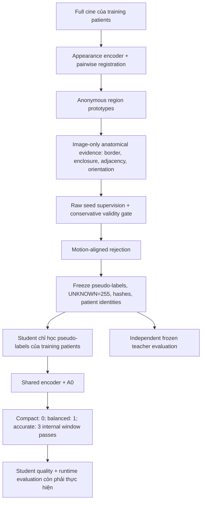

# Main baseline review: no-GT, lightweight deployment, Dice >= 0.90

Date: 2026-10-02. Audited upstream: `c31825a7f90df47f9f9382a9c9595e43f7f71236`.
User constraints: **fully no-GT training**; target device **RTX 4080 Super 16GB**.

Publication integration: remote main advanced to
`53fa6182ff8f5d262c2a45a8644e9b850a4d5c49` during this task. Its 12-file delta adds
the ADNet few-shot comparison lane and was preserved. The audited Self-Audit/v3
models and v3 config are byte-identical; the CPU receipt's source hashes still
match. ADNet consumes labeled support masks and is outside the primary no-GT
contract. Final validation below covers the integrated tree.

## Kết luận

Self-Audit v3 đã có pipeline teacher -> freeze -> student chạy được. Student nhỏ
về số tham số, nhưng chưa có bằng chứng hiện tại đủ để kết luận Dice >=90% hoặc
tốc độ trên RTX 4080 Super. Phải giải quyết chất lượng nhãn giả mang đúng tên
RV/MYO/LV trước khi thêm độ phức tạp hoặc chạy training dài.

`diffusion` thuộc baseline CUTS: scientific runner dùng PHATE + K-means, còn
route multiscale riêng dùng diffusion condensation gom embedding thành cụm ở
nhiều mức. Nó không nằm trong forward của Self-Audit v3. Đây cũng không
phải mô hình sinh mask bằng denoising diffusion. [Code chính thức CUTS](https://github.com/ChenLiu-1996/CUTS)
mô tả riêng bước học encoder và bước diffusion condensation; giữ nó để so sánh
phương pháp không khiến student phải chạy diffusion.

README cũ dẫn vào pipeline supervised `train_self_audit.py`; đó không phải
entrypoint phù hợp cho yêu cầu no-GT vừa xác nhận. Không được chuyển ngầm sang
supervised chỉ để đạt con số 90%.

## Flow đang tồn tại trên main

- Mỗi ảnh ba kênh là ngữ cảnh lát cắt không gian; `prev/cur/nxt` là ba thời điểm.
  Không thay thời gian bằng z-neighbours. Pipeline hiện tại dùng native geometry;
  probe 224/256 dưới đây không thay đổi preprocessing chính thức.
- Nguồn semantic là các quy tắc giải phẫu viết tay. Reconstruction, prototype
  consistency và entropy thấp tự chúng không xác nhận tên giải phẫu đúng.
- `scripts/run_full_pipeline_v3.py --train-student` không tự kiểm tra Dice
  teacher. `student_main` chỉ chặn tổng foreground bằng 0, chưa bảo đảm từng lớp
  có hỗ trợ. Đây là giới hạn hiện tại, không phải chứng chỉ `TEACHER_READY`.
- Evaluator hiện tại đo teacher, gộp voxel ED/ES trước khi tính Dice theo
  patient. Chưa có evaluator student, và CLI export chỉ hỗ trợ train/val;
  final-test export cùng metric ED/ES tách riêng dưới đây là đề xuất cần bổ sung,
  không phải hành vi đã triển khai.
- `self_audit.models.annotation_expert` vẫn được student dùng; module có lịch sử
  supervised không có nghĩa là student đang đọc GT. Phải kiểm tra đường dữ liệu
  và loss thực sự, đồng thời giữ các dependency đang được dùng.

Source details: [flow audit](01_FLOW_AUDIT.md),
[cleanup inventory](02_CLEANUP_AUDIT.md), [primary-source research](03_RESEARCH.md).

## Bằng chứng thu được trong lần này

Status **MEASURED_ENGINEERING_ONLY**, random weights, CPU FP32, batch 1, một
Torch thread, 10 warmups và 50 timed forwards/profile/shape. Python 3.11.16,
PyTorch 2.14.0 trên macOS arm64 không trùng canonical experiment environment.
Không phải CUDA, trained inference, native-volume end-to-end hay Dice evidence.

| Thành phần | Tham số |
|---|---:|
| Offline teacher | 184,815 |
| Toàn student đang resident, gồm refiner | 80,462 |
| Encoder + A0 của đường compact | 47,460 |
| Refiner tùy chọn | 33,002 |

Toàn bộ tham số student ở FP32 chiếm 321,848 bytes; đây là parameter storage,
không phải dung lượng file checkpoint, activation memory hay peak VRAM. Compact
hiện vẫn giữ weights refiner trong model; chưa export artifact cắt bỏ refiner.

| Probe shape | Profile | CPU p50 / p95 (ms) |
|---|---|---:|
| 1 x 3 x 224 x 224 | compact | 18.18 / 19.64 |
| 1 x 3 x 224 x 224 | balanced | 25.57 / 26.95 |
| 1 x 3 x 224 x 224 | accurate | 36.24 / 38.94 |
| 1 x 3 x 256 x 256 | compact | 26.03 / 28.42 |
| 1 x 3 x 256 x 256 | balanced | 36.67 / 40.09 |
| 1 x 3 x 256 x 256 | accurate | 55.46 / 57.64 |

Raw samples, config/source hashes and environment mismatch are in
[runtime_cpu.json](runtime_cpu.json); reproduction is in
[benchmark_student_runtime.py](benchmark_student_runtime.py). This probe
explicitly refuses a requested CUDA device when CUDA is unavailable.

## Hướng nghiên cứu được đề xuất, chưa phải kết quả

1. Khóa cohort, ontology, preprocessing, seed rules và checkpoint selection bằng
   image-only criteria trước khi evaluator mở mask. Giữ dữ liệu đánh giá thực
   sự chưa sử dụng; công bố việc development GT từng ảnh hưởng nghiên cứu trước.
2. Falsify semantic seeds bằng baseline image-only đơn giản, kiểm tra class
   support, geometry và negative controls. Không hạ threshold chỉ để có nhãn.
3. Khi có cơ sở tiếp tục, dùng cùng frozen training pseudo-labels để so sánh
   compact A0 với một U-Net nhỏ có skip connections. Quarter-resolution A0 cộng
   bilinear upsampling có nguy cơ mất biên MYO; decoder nhỏ là giả thuyết cần thử.
4. Giữ registration/graph processing offline nếu thực nghiệm chứng minh ích lợi.
   So sánh no-propagation, identity warp và motion rejection. Chỉ giữ Dynamic
   Window nếu cải thiện kết quả ở chi phí đo được so với refiner CNN đơn giản.
5. Đánh giá dense student độc lập: foreground macro Dice trên native 3D ED/ES,
   theo patient, không tính BG; báo RV/MYO/LV riêng, uncertainty, HD95 và thất bại.
   UNKNOWN không được loại khỏi mẫu số để nâng Dice. ACDC và M&Ms báo riêng.
6. Đo chính checkpoint đó trên 4080 Super: batch 1 latency p50/p95, throughput,
   peak allocated/reserved VRAM, host RAM, full checkpoint/export bytes; tách
   network-forward với cả đọc ảnh, transfer, preprocessing và dựng volume.
   Chi phí teacher/training/export được báo riêng.

Không dùng GT để chọn epoch, threshold, mapping, diffusion level hay kiến trúc
trong primary no-GT track. Có thể bác bỏ một claim sau independent evaluation;
nếu sửa phương pháp theo feedback đó thì phải công bố và dùng cohort mới cho
claim cuối. Không dùng mask-pretrained teacher, scribbles hoặc mask-derived ROI.

Mục tiêu Dice >=0.90 chỉ đạt khi phép đánh giá trên đúng checkpoint và protocol
cho kết quả đó. Các con số của bài supervised không chứng minh mục tiêu no-GT.
Kích thước nhỏ hiện đã được đếm; tốc độ GPU, chất lượng student và lợi ích của
refinement vẫn **NOT MEASURED**. Bản này không khởi chạy training dài.

## Cleanup và kiểm tra hoàn tất

Đã xoá 10 file obsolete, gồm ba runner legacy sau khi tách các helper calibration
còn dùng. Không sửa model/loss/dataset/config hoặc xoá baseline đối chiếu.
README phân biệt rõ no-GT v3 với supervised reference. Lịch sử tái lập được ghim
ở Git revision cũ; xem [chi tiết cleanup](04_CLEANUP_IMPLEMENTATION.md).

Bộ regression cuối: **451 passed**, active v12 freeze hợp lệ và không đổi hash.
Xem [validation](05_VALIDATION.md). Ba báo cáo Orca đã hoàn tất; lượt independent
review bổ sung bị lỗi readiness/login, nên không có independent final PASS.
[Completion accounting](06_ORCHESTRATION.md) ghi rõ phần coordinator tự hoàn tất.
